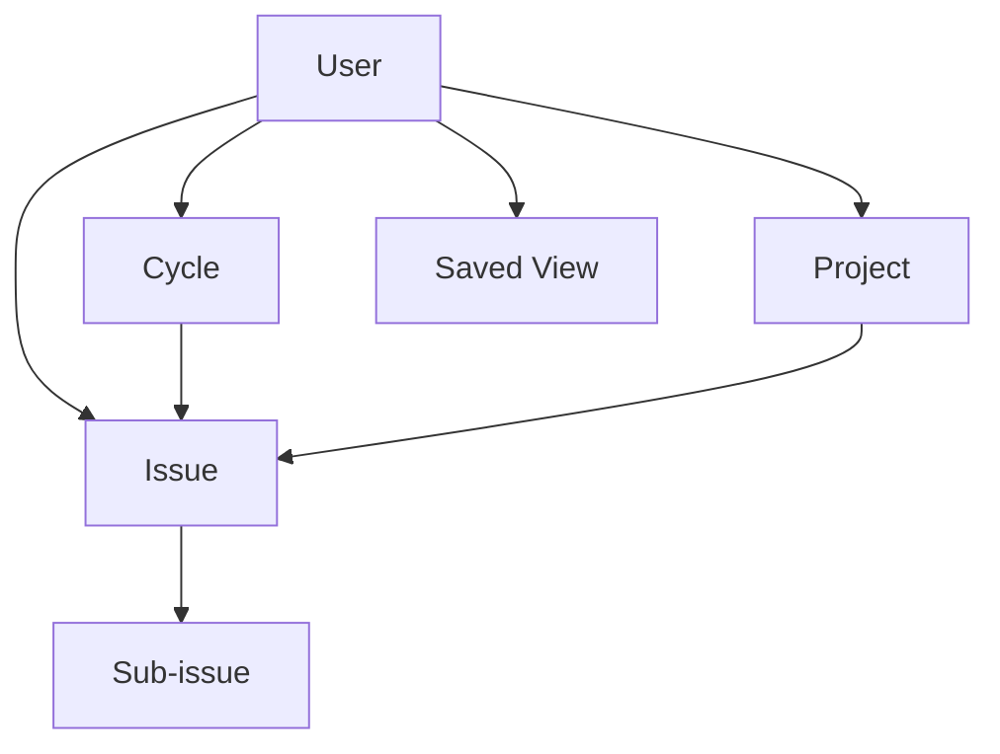
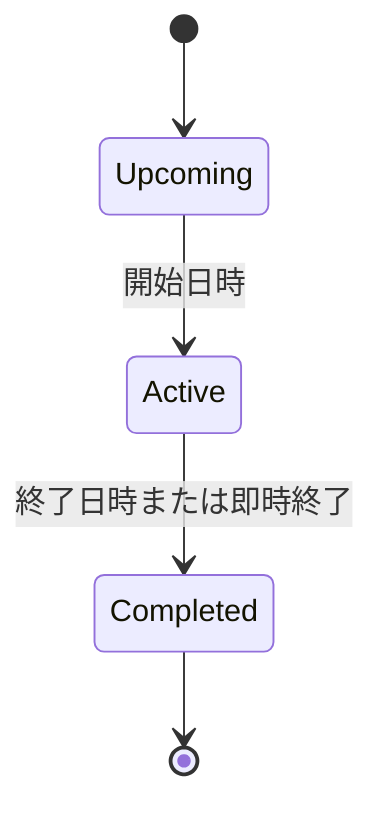
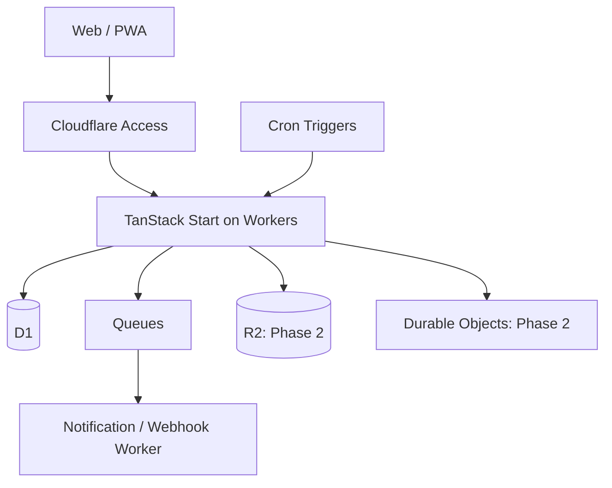

# Linearライク・プロジェクト管理アプリ 要件定義書

- 文書バージョン: 1.1
- 作成日: 2026-08-23
- 想定デプロイ先: Cloudflare Workers
- フロントエンド: TanStack Start（React）
- 想定読者: プロダクトオーナー、デザイナー、開発者、AIコーディングエージェント

## 1. 文書の目的

Linearの機能体系と操作思想を参考に、PC・スマートフォン・タブレットのすべてで高速かつ扱いやすいプロジェクト管理アプリを自作するための要件、優先順位、受入条件、技術構成を定義する。

本書は「Linearの完全な複製」ではなく、以下を満たす実用的な初期プロダクトを対象とする。

1. Issueを中心に日々の作業を管理できる
2. Cycleで一定期間の作業計画と振り返りができる
3. Projectで複数Issueを成果物単位に束ねられる
4. PCではキーボード中心、モバイルではタッチ中心に快適に操作できる
5. Cloudflare上で低運用負荷・低コストに提供できる
6. 将来、リアルタイム更新、外部連携、AIへ拡張できる

## 2. 調査結果の要約

Linearの概念モデルは、Issueを最小の作業単位とし、Teamがワークフローを所有し、Cycleが短期計画、Projectが成果物、Initiativeが複数Projectを束ねる上位目標、Viewが横断的な閲覧方法を担う構造である。[Linear Concepts](https://linear.app/docs/conceptual-model) 本アプリでは一人運用に合わせてTeamとWorkspaceを取り除き、WorkflowとCycleをユーザーへ直接所属させる。

Linearらしさを作っている要素は、単なるカンバンではなく次の組み合わせである。

- Issue作成・編集がどの画面からでも速い
- ListとBoardを即座に切り替えられる
- Filter、Group、Order、表示項目を組み合わせ、Viewとして保存できる
- キーボードショートカット、コマンドメニュー、一括選択・一括操作が主要導線になっている
- 楽観的更新（サーバー応答前にUIへ反映する方式）により操作待ちを感じさせない
- Cycleが反復スケジュール、自動生成、繰越、クールダウン、進捗グラフまで含む
- モバイルはPC画面の縮小ではなく、Home・Inbox・Create・Searchを中心に再構成されている

LinearのCycleは1〜8週間、曜日・タイムゾーン・クールダウン・最大15件の将来Cycleを設定でき、未完了Issueは原則として次Cycleへ自動繰越される。[Linear Cycles](https://linear.app/docs/use-cycles)

## 3. プロダクト定義

### 3.1 プロダクトビジョン

個人開発者が、「次に何をするか」「今Cycleでどこまで進んだか」「Projectが予定どおりか」を、端末を問わず数秒で把握・更新できる個人専用プロジェクト管理アプリを提供する。

### 3.2 解決する課題

- タスクの登録や属性変更に手数がかかり、管理が後回しになる
- スプリント管理が重く、計画や振り返りのための事務作業が増える
- PC向け管理画面がスマートフォンで操作しづらい
- List、Board、検索結果で同じ情報の見え方や操作方法が揃っていない
- よく使うFilterや表示方法を毎回作り直す必要がある

### 3.3 対象ユーザー

| ペルソナ | 主な目的 | 主な端末 |
| --- | --- | --- |
| 個人開発者 | Backlog整理、Cycle計画、進捗把握、Project管理 | PC、スマートフォン、タブレット |

### 3.4 初期前提

- 利用者本人だけがアクセスできる個人専用アプリとする
- Team、Workspace、メンバー、招待、Role、担当者の概念は持たない
- 日本語と英語を保存可能とし、初期UI言語は日本語とする
- WebアプリおよびPWA（インストール可能なWebアプリ）として提供し、ネイティブアプリは作らない
- CycleとWorkflowはユーザーに対して1系統とする
- 1 IssueはProjectとCycleにそれぞれ最大1件所属する

## 4. スコープと優先順位

優先度は Must / Should / Could / Won't（今回対象外）で表す。

### 4.1 MVP（初期リリース）

| 領域 | 要件 | 優先度 |
| --- | --- | --- |
| 認証 | Cloudflare Accessによる本人限定認証、ログアウト、セッション失効時の再認証 | Must |
| 個人設定 | タイムゾーン、Workflow、Cycle、テーマ設定 | Must |
| Issue | CRUD、状態、優先度、見積、期限、Label、Project、Cycle | Must |
| Issue | 親子Issue、メモ、活動履歴、関連Issue | Should |
| Cycle | 反復設定、自動生成、計画、繰越、進捗、履歴 | Must |
| Project | CRUD、状態、期間、Issue一覧、進捗 | Must |
| View | List / Board、Filter、Group、Order、保存View | Must |
| 操作 | コマンドメニュー、主要ショートカット、一括操作 | Must |
| 検索 | Issue ID・タイトル・説明の検索、属性絞り込み | Must |
| Inbox | アプリ内通知、既読、削除、遷移 | Should |
| UI | PC・スマホ・タブレット対応、ライト/ダーク | Must |
| PWA | ホーム画面追加、静的シェルのキャッシュ | Should |
| 監査 | 主要エンティティの変更履歴 | Must |

### 4.2 Phase 2

- InitiativeとロードマップTimeline
- Triage（外部連携から来たIssue候補の受け入れキュー）
- Issueテンプレート、Projectテンプレート
- 添付ファイル（Cloudflare R2）
- 通知スヌーズ、繰り返しReminder
- Webhook、公開API、GitHub / Slack連携
- CSV import / export
- CycleおよびProjectの高度な分析
- 完全なリアルタイム更新
- オフラインでのIssue作成・編集と再同期

### 4.3 Phase 3

- AIによるIssue分解、要約、重複候補、Cycle提案
- Customer Requests、SLA、Dashboard
- 高度な自動化、監査ログExport
- ネイティブモバイルアプリ

## 5. 情報構造



主要ナビゲーションは以下とする。

- Home
- Inbox
- Search
- Issues
- Cycles
- Projects
- Views
- Settings

## 6. 機能要件

### 6.1 認証・本人限定アクセス

| ID | 要件 | 受入条件 |
| --- | --- | --- |
| AUTH-01 | Cloudflare Access経由でメールOTPまたはGoogle認証できる | Access Policyで許可された1つのメールアドレスだけが認証成功する |
| AUTH-02 | Cloudflare Accessのセッションで本人確認を維持する | HTTPリクエストごとにWorkerが`Cf-Access-Jwt-Assertion`の署名・issuer・audienceを検証し、対応する所有者だけを許可する |
| AUTH-03 | 未認証アクセスとセッション失効をCloudflare Accessの再認証へ戻す | 通常NavigationはAccessがWorker到達前に保護し、Server Function / APIは失効時の401を検知して現在URLへTop-level Navigationする |
| AUTH-04 | 許可メールアドレスをAccess Policyで管理する | App側のClient bundleやログへ値を露出しない |
| AUTH-05 | SPA / PWAでAccessのセッション失効を回復できる | 同一Originの非同期リクエストへ`X-Requested-With: XMLHttpRequest`と`credentials: 'same-origin'`を付け、401をOffline・Timeout・5xxと区別し、再認証後に元のDeep linkへ戻る |
| AUTH-06 | HTTP以外のHandlerでも唯一の所有者を安全に解決する | Cronは`OWNER_USER_ID`を使用し、QueueはMessageの`user_id`と`OWNER_USER_ID`の一致を検証する。未設定・形式不正・対応する`users`行なしは更新せず失敗する |

Cloudflare Accessの認証画面はアプリ内Routeではない。ログアウトは`/cdn-cgi/access/logout`へのTop-level Navigationで行う。Service Workerは静的公開AssetだけをCacheし、認証済みSSR HTML、Server Function / API応答、Accessの401・Redirect・Login応答、個人データをCacheしない。[Cloudflare Access session management](https://developers.cloudflare.com/cloudflare-one/access-controls/access-settings/session-management/) [Cloudflare Access authorization cookie](https://developers.cloudflare.com/cloudflare-one/access-controls/applications/http-apps/authorization-cookie/)

### 6.2 個人設定・Workflow

| ID | 要件 | 受入条件 |
| --- | --- | --- |
| PREF-01 | タイムゾーン、UI言語、テーマを設定できる | タイムゾーンはCycle境界と日時表示、UI言語は画面文言と日時・数値形式、テーマは配色へ反映される。MVPのUI言語は日本語・英語、初期値は日本語とする |
| PREF-02 | Issue番号を`TASK-123`形式で一意かつ単調増加に採番する | 同時作成でも重複しない |
| PREF-03 | Estimateを有効・無効にできる | MVPはpoint単位の`1 / 2 / 3 / 5 / 8`だけを許可する。無効化しても既存値は保持するが、入力・Filter・Order・集計では使用しない |
| WF-01 | Workflow状態を設定できる | Backlog / Unstarted / Started / Completed / Canceledのカテゴリを持つ |
| WF-02 | 状態の名称、色、順序、既定値を変更できる | ユーザーごとの既定状態を常に1件だけ保ち、既存Issueとの整合性を保ったまま変更できる |
| WF-03 | Workflow状態を削除できる | 参照するIssueがある状態と既定状態の削除を拒否し、先にIssueの一括変更または別の既定状態の選択を求める |

### 6.3 Issue

LinearではIssueはTeamに必ず属するが、本アプリはTeamを持たない。タイトルと状態を必須、それ以外を任意とする点は踏襲する。[Linear Create issues](https://linear.app/docs/creating-issues)

| ID | 要件 | 受入条件 |
| --- | --- | --- |
| ISS-01 | どの主要画面からでもIssueを作成できる | PCは`C`、モバイルは中央の作成ボタンから2操作以内でComposerが開く |
| ISS-02 | Issueはtitle、description、statusを持つ | titleは1〜255文字、descriptionはMarkdown互換Rich Textである |
| ISS-03 | priority、estimate、due dateを設定できる | 未設定を許容し、一覧からインライン更新できる |
| ISS-04 | priorityはNo priority / Low / Medium / High / Urgentを持つ | 表示、Filter、Group、Orderで同じ定義を使う |
| ISS-05 | Labelを複数付与できる | Labelは名前と色を持つ |
| ISS-06 | Issueを最大1 Project、最大1 Cycleへ割り当てられる | ProjectとCycleの存在および本人所有を検証する |
| ISS-07 | Issue詳細をモーダルと専用URLの両方で開ける | URL共有時は同じIssueを直接開ける |
| ISS-08 | title、description、主要属性をインライン編集できる | 保存成功前にUIへ反映し、失敗時は戻して通知する |
| ISS-09 | 複数Issueを選択して一括更新できる | status、priority、cycle、project、labelに対応する |
| ISS-10 | 手動並び替えができる | 同一Group内でドラッグまたはキーボード操作により順序を保存する |
| ISS-11 | 親IssueとSub-issueを設定できる | 循環参照を禁止し、親子の進捗を表示する |
| ISS-12 | blocking / blocked by / related / duplicateを設定できる | 依存関係は双方向から確認できる |
| ISS-13 | 作業メモを追記・編集・削除できる | Markdownとコードブロックを扱える |
| ISS-14 | 変更履歴を時系列表示する | 作成、属性変更、メモ、アーカイブを時刻付きで記録する |
| ISS-15 | Issueをアーカイブ・復元・論理削除できる | 通常Viewから除外され、管理画面から復元できる |

Issueの依存関係はLinearのblocking、related、duplicateを踏襲する。[Linear Issue relations](https://linear.app/docs/issue-relations)

### 6.4 Cycle（最重要要件）

#### 6.4.1 Cycle設定

| ID | 要件 | 受入条件 |
| --- | --- | --- |
| CYC-01 | Cycleを有効化できる | 無効化しても過去Cycleは保持される |
| CYC-02 | 期間を1〜8週間で設定できる | 個人設定のタイムゾーン基準で開始・終了する |
| CYC-03 | 開始曜日を設定できる | 開始日の00:00を境界とする |
| CYC-04 | Cycle間のCooldownを0〜4週間で設定できる | Cooldown中はActive Cycleが存在しない。Upcoming Cycleへの計画割当と自動繰越は許可するが、現在Cycleへの割当は行わない |
| CYC-05 | 将来Cycleの生成数を1〜15件で設定できる | 設定変更時に不足分を自動生成する |
| CYC-06 | 将来Cycleの開始日・終了日を個別調整できる | 過去Cycleは変更不可、期間重複を禁止する |

#### 6.4.2 Cycleライフサイクル



CooldownはCycle自身の状態ではなく、前Cycleの終了から次Cycleの開始までActive Cycleが存在しない期間を表す。

| ID | 要件 | 受入条件 |
| --- | --- | --- |
| CYC-07 | Cycle状態をUpcoming / Active / Completedで自動判定する | 個人設定のタイムゾーンで境界を一貫して扱う |
| CYC-08 | 次Cycleを即時開始できる | 確認後、Cronと同じCAS方式の終了Serviceで現在Cycleを終了し、次CycleをActiveにする |
| CYC-09 | Active終了時に未完了Issueを次Cycleへ繰り越す | Workflow categoryがUnstartedまたはStartedのIssueだけを次Cycleへ移し、Backlog / Completed / Canceledは元Cycleに残す |
| CYC-10 | StartedまたはCompletedになった未所属Issueを現在Cycleへ自動追加できる | 個人設定でON/OFFでき、変更履歴にAutomationとして記録する |
| CYC-11 | Issueが繰り越された回数と元Cycleを保持する | Issue詳細およびCycle履歴から追跡できる |
| CYC-12 | Cycle終了処理を冪等に実行する | Cron再実行・同時実行・CYC-08との競合でも、条件付きUPDATEの勝者だけが処理し、重複Cycle・重複履歴・二重繰越・重複Outboxが発生しない |

#### 6.4.3 Cycle画面・分析

| ID | 要件 | 受入条件 |
| --- | --- | --- |
| CYC-13 | Current / Upcoming / Pastを切り替えられる | PC、タブレット、スマホで同じ情報へ到達できる |
| CYC-14 | CycleへIssueを追加・削除・並び替えできる | ListとBoardの両方から更新できる |
| CYC-15 | Scopeと完了率をIssue数・Estimateの両方で表示する | Estimate無効時または全Issueが未設定の場合はIssue数を既定とし、有効時の未設定IssueはEstimate合計で0として扱う |
| CYC-16 | 日別のCompleted、Remaining、Scope changeを表示する | Cycle開始時点と追加・削除の差分を再現できる |
| CYC-17 | 状態・優先度・Project別の内訳を表示する | Issue数またはEstimate合計を表示する |
| CYC-18 | Cycle名と説明を編集できる | 自動生成名とは別に任意の上書き名とRich Text説明を保存し、上書き名を解除すると自動生成名へ戻る |

### 6.5 Project

LinearのProjectは明確な成果または目標日を持つ作業単位で、Issue、概要、文書、マイルストーン、進捗を束ねる。[Linear Projects](https://linear.app/docs/projects)

| ID | 要件 | 受入条件 |
| --- | --- | --- |
| PRJ-01 | Projectを作成・編集・アーカイブできる | name以外は任意とする |
| PRJ-02 | status、priority、色、アイコンを設定できる | 一覧とIssue pickerに同じ表現を使う |
| PRJ-03 | start dateとtarget dateを設定できる | 日・月・四半期の入力粒度を日付とは別に保持し、元の精度で再表示できる |
| PRJ-04 | Project IssueをList / Boardで表示する | Filter、Group、Order、保存Viewに対応する |
| PRJ-05 | 完了率をIssue数またはEstimateで表示する | canceled Issueを母数から除外し、Estimate無効時または全Issueが未設定の場合はIssue数を使う |
| PRJ-06 | Project詳細に概要、説明、プロパティ、Issue、進捗を表示する | タブまたはモバイル向けセクションで切り替えられる |
| PRJ-07 | Project statusを手動更新する | Backlog / Planned / In Progress / Completed / Canceledカテゴリを持つ |
| PRJ-08 | Project statusの名称、色、順序、既定値を設定できる | ユーザーごとの既定値を1件だけ保ち、参照中または既定の状態は削除を拒否して、先にProjectの一括変更または別の既定値の選択を求める |

### 6.6 View・Filter・Board

LinearはList / Boardの切替、Group、Order、表示項目をDisplay optionsとして保持し、Filter済み画面をCustom Viewとして保存できる。[Linear Display options](https://linear.app/docs/display-options) [Linear Custom Views](https://linear.app/docs/custom-views)

| ID | 要件 | 受入条件 |
| --- | --- | --- |
| VIEW-01 | Issue一覧をList / Boardで切り替えられる | 同じFilter条件と選択状態を維持する |
| VIEW-02 | status、priority、label、project、cycle、due date、created dateでFilterできる | 複数条件のANDをMVPで提供する |
| VIEW-03 | status、priority、project、cycle、labelでGroup化できる | 空Groupの表示/非表示を切り替えられる |
| VIEW-04 | manual、priority、updated、created、due date、estimateでOrderできる | OrderはListとBoardで共有する |
| VIEW-05 | 表示プロパティを選択できる | 全体の既定値を個人設定へ保存し、Saved Viewでは`layout_json`の値を優先する |
| VIEW-06 | Filter・Group・Order・LayoutをViewとして保存できる | 名前を付けて追加・編集・削除できる |
| VIEW-07 | Filter条件をURLへ反映する | URL共有で主要Filterを再現できる |
| VIEW-08 | PCで複数Issueを選択できる | Shift範囲選択、全選択、Esc解除に対応する |

高度なAND / OR・入れ子FilterはPhase 2とする。Linearの高度なFilterはAND / ORと入れ子条件をサポートしている。[Linear Filters](https://linear.app/docs/filters)

### 6.7 Search・Command menu・ショートカット

| ID | 要件 | 受入条件 |
| --- | --- | --- |
| NAV-01 | 全体検索でIssue ID、title、descriptionを検索できる | 300ms以内のデバウンス、属性Filter、キーボード選択に対応する |
| NAV-02 | 最近開いたIssueと最近の検索を表示する | D1へ種別ごとに最大20件保存して端末間同期し、同一対象・同一検索条件は最新時刻へ更新する。削除済みIssueは表示しない |
| NAV-03 | `Cmd/Ctrl + K`でCommand menuを開ける | ナビゲーション、作成、選択中Issueの操作を検索できる |
| NAV-04 | 単一キーショートカットを提供する | 入力欄フォーカス中は発火しない |
| NAV-05 | ショートカット一覧を表示できる | `?`で開き、OSに応じたキー表記をする |

MVP推奨ショートカット:

| キー | 操作 |
| --- | --- |
| `C` | Issue作成 |
| `Cmd/Ctrl + K` | Command menu |
| `Cmd/Ctrl + F` | 現在View内検索 |
| `F` | Filter |
| `Shift + V` | Display options |
| `Cmd/Ctrl + B` | List / Board切替 |
| `X` | Issue選択 |
| `Esc` | 閉じる / 選択解除 |

### 6.8 Inbox・通知

| ID | 要件 | 受入条件 |
| --- | --- | --- |
| NOTIF-01 | 期限接近、期限超過、Cycle開始・終了、自動処理失敗をInboxへ通知する | 種別、対象、時刻、既読状態を持つ |
| NOTIF-02 | 通知を既読・未読・削除できる | 複数端末間で状態が同期する |
| NOTIF-03 | 通知から対象Issue、Cycleまたは関連画面へ移動できる | モバイルでは戻る操作でInbox位置を復元する |
| NOTIF-04 | 通知種別ごとにON/OFFできる | ユーザー設定へ保存する |

### 6.9 Settings・監査・データ管理

- Profile、Workflow、Cycle、Label、Project status、通知、テーマを設定できる
- 業務データの作成・更新・削除は、actor、action、entity、before/after差分、request ID、timestampを記録する
- JSONまたはCSVでIssueをExportできる（Phase 2）
- Issue、Project、通知、メモ、Saved Viewの削除は原則論理削除とし、Trashから30日以内に復元できる
- `deleted_at`から30日を超えたデータは、Cronが依存データとともに物理削除する。Jobは冪等とし、実行結果を監査イベントへ記録する
- D1 Time TravelおよびBackup上の保持は、アプリ内の30日復元期限には含めない

## 7. UI / UX要件

### 7.1 共通原則

1. 主要操作は画面遷移なしのインライン編集またはDialog / Sheetで完結させる
2. Mutationは楽観的更新し、失敗時にロールバックと再試行を提示する
3. URLは選択中View、Issue、主要Filterを表現する
4. Focus、選択、Hover、Drag、保存中、エラーの状態を視覚的に区別する
5. PointerとKeyboardのどちらでも同じ操作結果へ到達できる
6. 端末幅ではなく利用文脈に合わせて情報密度を変える

### 7.2 レスポンシブ設計

| 区分 | 目安 | ナビゲーション | Issue詳細 | 一覧操作 |
| --- | --- | --- | --- | --- |
| Mobile | 〜767px | 下部5タブ + 必要時Sheet | Full screen route | 1列、Swipe補助、長押しMenu |
| Tablet | 768〜1199px | 折りたたみSidebar | 右側SheetまたはFull screen | List / Board、タッチDrag |
| Desktop | 1200px〜 | 固定Sidebar | Modal + URL、またはSplit view | 高密度List / Board、Keyboard中心 |

モバイル下部タブは Home / Inbox / Create / Search / Menu とする。LinearのモバイルもHome、Inbox、Create、Search、Settingsを主要入口としている。[Linear mobile](https://linear.app/docs/get-the-app)

### 7.3 タッチ要件

- タップ領域は原則44×44 CSS px以上
- Drag開始はハンドルまたは長押しとし、スクロールを妨げない
- Hoverでのみ現れる必須操作を作らない
- Swipe actionは補助導線とし、同じ操作をMenuからも実行可能にする
- Bottom sheetはSafe Areaを考慮する
- Boardは横スクロール可能にし、列幅を端末幅に合わせる

### 7.4 アクセシビリティ

- WCAG 2.2 AAを目標とする
- すべての操作をキーボードで実行可能にする
- Focus ringを常時識別可能にする
- 色だけでStatus、Priority、エラーを伝えない
- Dialog、Menu、Combobox、Tooltipは適切なARIAとFocus trapを持つ
- `prefers-reduced-motion`を尊重する

### 7.5 体感性能

- 操作直後100ms以内に視覚フィードバックを返す
- List初回表示のLCP（最大コンテンツ描画）p75を2.5秒以下にする
- INP（操作応答性）p75を200ms以下にする
- 1000 IssueのViewで仮想スクロールし、DOM行数を抑える
- Route単位でデータを先読みし、戻る操作でScroll、Filter、選択状態を復元する

## 8. 非機能要件

| 分類 | 要件 |
| --- | --- |
| 可用性 | 月間99.9%を目標とし、Cloudflare障害時を除くアプリ起因エラー率を監視する |
| 性能 | 通常APIのp95を500ms以下、検索APIのp95を800ms以下とする |
| 整合性 | Issue更新はversionによる楽観的ロックを行い、競合時は上書きせず再取得させる |
| セキュリティ | OWASP ASVS Level 2相当、全Mutationで認証・認可・入力検証・CSRF対策を行う |
| データ保護 | 全Queryを認証済みuser_idでスコープし、他アカウントのデータへアクセスできないようにする |
| プライバシー | ログへ本文、Cookie、Token、メールアドレスを不用意に出力しない |
| バックアップ | D1 Time Travelを利用し、定期Export手順を用意する。FTS Virtual tableは派生IndexとしてExport前に除外し、復元後にMigrationと再Indexで再構築する。[D1 import / export](https://developers.cloudflare.com/d1/best-practices/import-export-data/) |
| 観測性 | request ID、構造化ログ、エラー、Latency、D1 query、Queue失敗を追跡する |
| 保守性 | TypeScript strict、境界Schema、Migration、ADR、Feature単位のモジュール構成を採用する |
| 互換性 | 最新2世代のChrome、Safari、Edge、Firefoxおよび現行iOS/Androidブラウザを対象とする |
| テスト | Domain unit、Repository integration、主要JourneyのPlaywright E2Eを自動化する |

## 9. 技術選定

### 9.1 推奨スタック

| レイヤー | 採用技術 | 採用理由 |
| --- | --- | --- |
| 言語 | TypeScript（strict） | フロントからWorkerまで型を統一できる |
| Full-stack | TanStack Start + React | Router中心、SSR、Server Functions、型安全なルーティングを利用できる |
| Build / Deploy | Vite + `@cloudflare/vite-plugin` + Wrangler | TanStack公式のCloudflare Workers構成である |
| UI | Tailwind CSS + shadcn/ui（Base UI） | デザインを所有しつつAccessibleなPrimitiveを利用できる |
| Data fetching | TanStack Query | Cache、Mutation、楽観的更新、再取得制御に強い |
| Form | TanStack Form + Zod | 複雑な編集フォームと型付きValidationに対応する |
| Table / List | TanStack Table + TanStack Virtual | 高密度Listと大量行の仮想化に向く |
| Drag & Drop | dnd-kit系のReact対応ライブラリ | Pointer / Touch / Keyboard Sensorを統一しやすい |
| Rich text | Tiptap（ProseMirror） | Markdown互換の拡張可能なIssue Editorを作りやすい |
| i18n | i18next + react-i18next | 日本語・英語の辞書とSSR / Clientで一貫したLocale解決を扱える |
| DB | Cloudflare D1 | リレーショナルなIssue管理に適し、Worker Bindingで運用負荷が低い |
| ORM | Drizzle ORM + Drizzle Kit | D1を正式サポートし、型安全SQLとMigrationを扱える |
| Auth | Cloudflare Access | 一人専用のためApp内にUser・Session・招待機能を実装せず、メールAllow policyで保護できる |
| Async | Cloudflare Queues | 通知生成、Webhook、集計更新をRequestから分離できる |
| Scheduler | Workers Cron Triggers | Cycle開始・終了・将来Cycle生成、論理削除データのPurge、Outbox再送を定期実行できる |
| Realtime | Durable Objects + WebSocket（Phase 2・任意） | PCとモバイル間の即時Push更新に向く |
| File | Cloudflare R2（Phase 2） | 添付ファイルをDBと分離できる |
| Test | Vitest + Playwright + MSW | Unit、Browser E2E、外部I/O Mockを分担できる |
| Quality | ESLint + Prettier + TypeScript + Lefthook | 静的検査とローカル品質ゲートを統一する |
| Observability | Workers Logs + OpenTelemetry互換の外部Sink | 構造化ログと分散追跡へ拡張できる |

TanStack Startは2026-08-23時点でRC表記であるため、本番採用は可能でも破壊的変更リスクを受け入れる必要がある。一方、Cloudflare Workersは公式PartnerとしてVite Pluginを使う手順が提供されている。[TanStack Start](https://tanstack.com/start/latest) [TanStack Start Hosting](https://tanstack.com/start/latest/docs/framework/react/guide/hosting)

Drizzle ORMはCloudflare D1とWorkers環境を正式にサポートする。[Drizzle D1](https://orm.drizzle.team/docs/sqlite/connect-cloudflare-d1) shadcn/uiにもTanStack Start向けセットアップがある。[shadcn TanStack Start](https://ui.shadcn.com/docs/installation/tanstack)

一人運用では認証ライブラリを導入するより、Cloudflare AccessのSelf-hosted applicationとしてWorker全体を保護し、本人のメールアドレスだけをAllowする方が実装・攻撃面・運用を小さくできる。Access通過後もWorkerで署名済みJWTを検証する。[Cloudflare Access policies](https://developers.cloudflare.com/cloudflare-one/access-controls/policies/) [Validate Access JWT](https://developers.cloudflare.com/cloudflare-one/access-controls/applications/http-apps/authorization-cookie/validating-json/)

### 9.2 Cloudflare構成



#### 構成判断

- 主データはD1に集約する。D1は管理DBとしてMigration、Import / Export、Query insightsを備える。一方、Durable Objects SQLiteは強整合な状態と計算を同一場所に置けるが、初期構築の複雑性が増すため、MVPの主DBにはしない。[Cloudflare storage options](https://developers.cloudflare.com/workers/platform/storage-options/)
- RealtimeはMVPでポーリング/再検証に留め、Phase 2でDurable Objectsを導入する。Durable Objectsは複数Clientの状態調停とWebSocketに適する。[Cloudflare Durable Objects](https://developers.cloudflare.com/durable-objects/)
- 通知、Webhook、重い集計はQueuesへ送り、API応答時間と再試行性を確保する。Queuesは保証付き配送、Batch、Retry、Delayに対応する。[Cloudflare Queues](https://developers.cloudflare.com/queues/)
- D1 Read Replicationを有効にする場合はSessions APIとBookmarkを用い、同一Browser session内のsequential consistency（順序一貫性）を確保する。[D1 read replication](https://developers.cloudflare.com/d1/best-practices/read-replication/)
- HTTP Handlerは検証済みAccess JWTのemailが`OWNER_USER_ID`に対応する`users.email`と一致する場合だけ所有者を返す。CronはWorker環境変数`OWNER_USER_ID`を使い、Queue Messageはproducerが確定した`user_id`と`event_id`を持たせ、consumerで`OWNER_USER_ID`との一致を検証する。Cron / Queueのactorは`system:cron` / `system:queue`として監査へ記録する。[Workers Scheduled handler](https://developers.cloudflare.com/workers/runtime-apis/handlers/scheduled/) [Queues consumers](https://developers.cloudflare.com/queues/reference/how-queues-works/)
- 初回Deploy時にUUID v7の唯一の`users`行をBootstrapし、そのIDを`OWNER_USER_ID`へ設定する。Binding未設定、UUID不正、対応行なし、Access JWTの本人識別子が所有者と対応しない場合はFail closedとする。
- Queueは再配送を前提とし、D1 Outboxを配送状態の正本にする。Queue保持期限へ依存せず、未完了EventをCronから再投入できるようにする。
- Accessセッション失効時は共通Fetch層で401を検知し、Client Routerではなく現在URLをTop-levelで再読込する。Window focus復帰時・Network再接続時・30秒周期にもServer stateを再検証する。

### 9.3 API方針

- 画面内呼び出し: TanStack Start Server Functions
- 外部連携・Webhook・将来Public API: `/api/v1` Server Routes
- Validation: 入出力ともZod Schema
- Error: `code`, `message`, `fieldErrors`, `requestId`の統一Envelope
- Mutation: `idempotencyKey`とentity `version`を受け取る
- Mutationの事前読取: D1 Read Replication有効時は`withSession('first-primary')`を使い、条件付きUPDATEのCASを最終判定とする
- Pagination: cursor方式
- D1アクセス: Server側のみ。BrowserへBindingやTokenを露出しない

### 9.4 フロントエンド状態管理

- Server state: TanStack Query
- URL state: TanStack Routerのsearch params
- Form state: TanStack Form
- Local UI state: React state / context
- 永続的な個人表示設定: DB。ただし一時的な開閉状態はlocalStorage
- 最近開いたIssueと最近の検索: D1へ保存して端末間同期。一時的な入力中QueryはURLまたはLocal UI state
- Redux等の包括的StoreはMVPで採用しない

TanStack QueryはMutation応答前にCacheを更新する楽観的更新を公式にサポートする。[TanStack Query optimistic updates](https://tanstack.com/query/latest/docs/framework/react/guides/optimistic-updates)

## 10. データモデル概要

すべての主キーはUUID v7または同等の時系列ソート可能IDを使用し、日時はUTCのUnix millisecondsで保存する。個人専用でも認証境界を明確にするため、主な業務テーブルは`user_id`を持つ。

| Entity | 主な属性 |
| --- | --- |
| users | id, name, email, avatar_url, created_at |
| user_preferences | user_id, timezone, locale, theme, issue_counter, estimate_enabled, estimate_scale, default_issue_display_json |
| workflow_states | id, user_id, name, category, color, position, is_default |
| cycles | id, user_id, number, name_override, description_json, starts_at, ends_at, status, completed_at, completion_token |
| cycle_settings | user_id, enabled, duration_weeks, cooldown_weeks, start_weekday, future_count, auto_add_to_current_cycle |
| project_statuses | id, user_id, name, category, color, position, is_default |
| projects | id, user_id, name, status_id, priority, color, icon, description_json, start_at, start_precision, target_at, target_precision, archived_at, deleted_at |
| issues | id, user_id, number, title, description_json, description_text, status_id, priority, estimate, due_at, project_id, cycle_id, parent_id, position, version, last_mutation_key, archived_at, deleted_at, created_at, updated_at |
| labels | id, user_id, name, color |
| issue_labels | issue_id, label_id |
| issue_relations | source_issue_id, target_issue_id, type |
| issue_notes | id, issue_id, user_id, body_json, edited_at, deleted_at |
| cycle_issue_history | id, user_id, issue_id, from_cycle_id, to_cycle_id, reason, moved_at |
| saved_views | id, user_id, name, entity_type, query_json, layout_json, deleted_at |
| recent_issue_views | user_id, issue_id, viewed_at |
| recent_searches | id, user_id, normalized_query_json, searched_at |
| notifications | id, user_id, type, entity_type, entity_id, read_at, deleted_at, created_at |
| notification_preferences | user_id, notification_type, enabled |
| activity_events | id, user_id, actor_type, actor_id, entity_type, entity_id, action, request_id, before_json, after_json, created_at |
| outbox_events | id, user_id, event_id, type, payload_json, dedupe_key, status, attempt_count, available_at, created_at |
| mutation_receipts | id, user_id, idempotency_key, operation, response_json, created_at, expires_at |

### 10.1 主要制約・Index

- `issues(user_id, number)` unique
- `issues(user_id, status_id, updated_at)`
- `issues(user_id, cycle_id, position)`
- `issues(user_id, project_id, status_id, position)`
- `notifications(user_id, read_at, created_at)`
- `activity_events(user_id, entity_type, entity_id, created_at)`
- `cycles(user_id, number)` unique
- `cycle_issue_history(user_id, issue_id, from_cycle_id, to_cycle_id, reason)` unique
- `outbox_events(user_id, dedupe_key)` unique
- `mutation_receipts(user_id, idempotency_key)` unique
- `workflow_states(user_id)`と`project_statuses(user_id)`は、それぞれ`is_default = true`を1件だけ許可する部分Unique Indexを持つ
- `workflow_states.category`はBacklog / Unstarted / Started / Completed / Canceled、`project_statuses.category`はBacklog / Planned / In Progress / Completed / Canceledだけを許可する
- 最近閲覧と最近の検索は同一対象をUpsertし、種別ごとに新しい20件だけを保持する
- 親子Issueは同一ユーザー所有に限定し、再帰更新前に循環を検出する
- Relationは正規化した組み合わせに一意制約を置く
- Project、Cycle、Workflow state、Project status、Labelを参照する書き込みは、参照先が同じ`user_id`を持つことを検証する

検索はD1 SQLite FTS5を採用し、Issue番号、title、`description_text`を索引化する。Issue保存時にServer側でTiptap JSONから`description_text`を生成し、JSON・射影列・FTS Indexを同一書き込み処理で更新する。FTS Indexは再構築可能な派生データとして扱う。Phase 0ではtrigramを含むTokenizer、MATCH QueryのEscape、3文字未満のIssue ID・title Prefix検索、英日混在の検索品質、1万Issue時のLatencyとRows readを検証する。FTS5が品質・性能目標を満たさない場合も、`description_text`への検索を含むFallbackでNAV-01を満たす。高度な全文検索は外部検索基盤を導入するまでPhase 2とする。[D1 supported SQLite extensions](https://developers.cloudflare.com/d1/sql-api/sql-statements/) [D1 index best practices](https://developers.cloudflare.com/d1/best-practices/use-indexes/)

## 11. 主要処理フロー

### 11.1 Issue更新

```ts
const updateIssue = createServerFn({ method: 'POST' })
  .inputValidator(updateIssueSchema)
  .handler(async ({ data, context }) => {
    const user = await requireAllowedUser(context)
    const current = await issueRepo.findOwnedBy(data.id, user.id)
    const next = buildUpdatedIssue(current, data)

    const [updated] = await db.batch([
      // UPDATE issues SET ..., version = version + 1, last_mutation_key = ?
      // WHERE id = ? AND user_id = ? AND version = ?
      issueRepo.updateByVersion(next),
      activityRepo.appendIfMutationMatches(
        buildIssueDiff(user, current, next),
        data.idempotencyKey,
      ),
      outboxRepo.enqueueUniqueIfMutationMatches(
        buildIssueUpdatedEvent(user, current, next),
        data.idempotencyKey,
      ),
      mutationReceiptRepo.recordIfMutationMatches(
        data.idempotencyKey,
        buildMutationResponse(next),
      ),
    ])

    if (updated.meta.changes === 0) {
      const receipt = await mutationReceiptRepo.find(user.id, data.idempotencyKey)
      if (receipt) return receipt.response // 同一Mutationの再送
      throw new ConflictError('ISSUE_VERSION_CONFLICT')
    }

    return next
  })
```

Version比較はWorker上の事前読取だけに依存せず、条件付きUPDATEをCASとして使う。同一`batch()`内のActivity、Outbox、Mutation receiptは`last_mutation_key`との一致でGuardし、CASの勝者だけが書き込む。クライアントは`onMutate`でCacheを先に更新し、409 Conflict時は最新Issueを取得して差分を提示する。

### 11.2 Cycle終了

```ts
async function closeCycle(
  cycleId: string,
  ownerUserId: string,
  now: Date,
  trigger: 'scheduled' | 'manual',
) {
  const completionToken = crypto.randomUUID()

  const [claimed] = await db.batch([
    // UPDATE cycles SET status = 'completed', completed_at = ?, completion_token = ?
    // WHERE id = ? AND user_id = ? AND status = 'active'
    //   AND (ends_at <= ? OR ? = 'manual')
    cycleRepo.completeIfActive(
      cycleId,
      ownerUserId,
      now,
      trigger,
      completionToken,
    ),
    cycleRepo.ensureNextIfTokenMatches(cycleId, completionToken),
    cycleRepo.activateNextIfDueOrManualAndTokenMatches(
      cycleId,
      trigger,
      completionToken,
    ),
    cycleHistoryRepo.recordCandidatesIfTokenMatches(cycleId, completionToken),
    issueRepo.moveCandidatesIfTokenMatches(cycleId, completionToken),
    outboxRepo.enqueueUniqueIfTokenMatches(
      `cycle.completed:${cycleId}`,
      cycleId,
      completionToken,
    ),
  ])

  if (claimed.meta.changes === 0) return // 完了済み、期限前、または別Jobが勝利
}
```

`batch()`の結果を受け取るまで途中分岐できないため、後続SQLはすべて同じ`completion_token`の存在を条件にする。候補抽出は事前SELECTせず、`INSERT ... SELECT`と集合UPDATEで`user_id`、元`cycle_id`、Workflow categoryをbatch内で再評価する。次Cycle、繰越履歴、Outboxには一意制約を置く。Batch中の失敗はCASを含めてRollbackされるため、外部から遷移中状態は見えない。[D1 batch API](https://developers.cloudflare.com/d1/worker-api/d1-database/)

Cronは短い間隔で「境界を過ぎた未処理Cycle」を取得する。時刻ぴったりの1回だけに依存せず、状態遷移のCAS、一意制約、冪等な再実行で重複処理を吸収する。

## 12. 画面一覧

| 画面 | 主な内容 | Mobile差分 |
| --- | --- | --- |
| Home | Current Cycle、期限超過・期限接近、Recently updated | Card中心 |
| Issues | List / Board、Filter、Group、Bulk action | List優先、FilterはBottom sheet |
| Cycle list | Current、Upcoming、Past | 横SwipeまたはSelect |
| Cycle detail | Summary、Graph、Issues、Status / Priority / Project別内訳 | Summaryを折りたたみ表示 |
| Project list | List / Board、Progress | Card密度を下げる |
| Project detail | Overview、Issues、Progress | Section navigation |
| Issue detail | Title、Description、Properties、Relations、Notes、Activity | Full screen route |
| Search | Query、Recent、Result、Filter | 下部タブからFull screen |
| Inbox | Notification list、Detail link | 下部タブ |
| Saved Views | 保存View一覧 | 1列 |
| Trash | 論理削除済みデータ、削除予定日、復元 | Settings配下のFull screen route |
| Settings | Profile、Workflow、Cycle、Estimate、Label、Project status、通知、言語、Theme | 項目ごとに下層Route |

Cloudflare Accessが提供する認証画面はアプリ画面一覧の対象外とする。

## 13. 受入シナリオ

### AC-01 Issue作成

```gherkin
Given 本人がログインしてIssuesを開いている
When Cを押してタイトルを入力しEnterで確定する
Then 1秒以内にIssueが一覧へ表示される
And `TASK-123`形式のIssue番号が採番される
And URLを開くと同じIssue詳細を表示できる
```

### AC-02 Cycle繰越

```gherkin
Given Active CycleにBacklogとUnstartedとStartedとCompletedとCanceledのIssueがある
And Cycle終了時刻を過ぎている
When 同じCycleの終了Jobが並行して実行される
Then UnstartedとStartedのIssueだけが次Cycleへ移る
And BacklogとCompletedとCanceledのIssueは元Cycleに残る
And 元CycleはCompletedになる
And 次Cycle、繰越履歴、Outbox eventはそれぞれ1回だけ作成される
And Jobを再実行しても結果は変わらない
```

### AC-03 端末横断

```gherkin
Given PCでIssueをHigh priorityへ変更した
When 同じユーザーがスマートフォンで対象Issueを開く
Then High priorityが表示される
And スマートフォンからStatusを変更できる
And タップ対象が重なったり横にはみ出したりしない
```

### AC-04 楽観的更新失敗

```gherkin
Given Issue一覧を表示している
When Status変更の保存がサーバーで失敗する
Then UIは変更前のStatusへ戻る
And Error理由と再試行操作を表示する
And 他Issueの選択やScroll位置は維持される
```

### AC-05 Accessセッション再認証

```gherkin
Given standalone PWAでIssue詳細を開いている
And Cloudflare Accessのセッションが失効している
When Server Functionを呼び出す
Then 401をNetwork障害や5xxと区別して検知する
And 現在URLへのTop-level NavigationでCloudflare Accessの再認証へ移る
And 再認証後に同じIssue詳細へ戻る
And 認証応答や個人データをService WorkerへCacheしない
```

### AC-06 所有者境界

```gherkin
Given JWTを持たないCronまたはQueue consumerが起動する
When `OWNER_USER_ID`が唯一のusers行と一致する
Then そのuser_idに属するデータだけを処理する
But Binding未設定、対応行なし、またはQueue messageのuser_id不一致の場合
Then 業務データを更新せず失敗を記録する
```

### AC-07 Issue更新競合

```gherkin
Given 同じIssue versionを読んだ2つのMutationがある
When 2つを並行実行する
Then 条件付きUPDATEに成功した1件だけが保存される
And もう1件は409 Conflictになる
And Activity、Outbox event、Mutation receiptは勝者の1件だけ作成される
```

## 14. テスト戦略

- Unit: Cycle境界・Cooldown、繰越対象、Estimate ON/OFF、権限、Workflow / Project status遷移、Filter変換、Position計算、Tiptap JSONから検索Textへの射影
- Integration: D1 Migration、Repositoryの`user_id`所有境界、Issue採番、Issue / CycleのCASと同時実行、Batch rollback、一意制約、recent最大20件、30日Purge、Outbox再投入
- Component: Dialog、Combobox、Board card、Touch drag、Keyboard操作、UI言語切替、Estimate表示切替
- E2E: Access認証・拒否・Logout・セッション失効からの復帰、Issue CRUD、Bulk edit、Cycle設定・繰越、Project進捗、Saved View、Trash復元、Mobile / standalone PWA viewport
- Accessibility: axeによる自動検査 + Keyboardのみの主要Journey
- Performance: 1万IssueのSeedで一覧、Filter、英日混在のtitle / description検索、Cycle集計を計測
- Resilience: Queue再試行・保持期限超過後のOutbox再投入、Cron / CYC-08同時実行、Batch途中失敗、誤った`OWNER_USER_ID`、API timeout、Mutation conflictをFault injectionする

## 15. 開発フェーズ案

| Phase | 成果物 | 完了条件 |
| --- | --- | --- |
| 0. Technical spike | TanStack Start + Workers + D1 + Authの縦切りPoC | Access認証・拒否・失効復帰、Issue 1件CRUD、Preview deployが動く |
| 1. Foundation | 本人限定認証、Owner bootstrap、個人設定、Workflow、共通UI | 未認証・未許可ユーザー・Owner誤設定の拒否テストが通る |
| 2. Issue core | Issue CRUD、List、Detail、属性、Bulk | PC主要Journeyが通る |
| 3. Cycle | 設定、自動生成、繰越、Current/Past、Graph | AC-02と境界テストが通る |
| 4. Project / View | Project、Board、Filter、Saved View | 横断利用が可能になる |
| 5. Mobile / PWA | 下部Navigation、Touch最適化、PWA | 主要Mobile E2EとAA検査が通る |
| 6. Release hardening | Inbox、監査、性能、Backup、Purge、Outbox再送、運用手順 | SLO、Security、Restore drillを満たす |

## 16. リスクと判断事項

| リスク | 影響 | 対応 |
| --- | --- | --- |
| TanStack StartがRC | API変更・Upgrade工数 | Version固定、薄いFramework境界、Phase 0でDeploy検証 |
| D1はSQLite制約を持つ | 高度な全文検索・複雑な分析 | Index設計、集計テーブル、必要時Postgres + Hyperdrive移行 |
| 高機能DnDは端末差が大きい | Mobile操作不良、Accessibility低下 | Keyboard代替、Touch sensor、実機E2E、Menu操作も提供 |
| 楽観的更新の競合 | 表示巻き戻り・上書き | version、Idempotency key、Conflict UI |
| Cycle自動処理 | 二重繰越・時刻ずれ | UTC保存、個人timezone変換、Token付きCAS、一意制約、冪等Job、境界Unit test |
| Linear全機能を追う | MVP肥大化 | Mustの完了までPhase 2機能を着手しない |
| Rich text | XSS・データ互換性 | JSON schema、sanitize、Markdown export、editor version保持 |

### Phase 0で実装可能性・品質を確定する項目

1. 承認済みのD1 Token付きCAS方式について、Drizzleでの`meta.changes`取得、同時実行、Batch rollback、CYC-08競合、履歴・Outbox・次Cycleの重複防止
2. Cloudflare Access JWT検証、非同期リクエストへの401契約、Top-level再認証、元URL復帰、Logout、standalone PWAでのTanStack Start SSR / Server Functions保護
3. D1 FTS5のTokenizer、短い検索語、英日混在の検索品質、射影・Index整合性、1万Issue時のLatency、およびExport / Restore時の再Index手順
4. 採用するDnDライブラリのReact現行版対応とTouch / Keyboard品質
5. Tiptap JSONからMarkdownへの可逆性とsanitize方針

## 17. MVP完成の定義

以下をすべて満たしたとき、MVP完成とする。

- 本人一人でIssue、Cycle、Project、Viewの日常運用ができる
- Cycleが設定に従って自動生成・開始・終了・繰越される
- PC、スマートフォン、タブレットで主要Journeyが完了する
- PCではIssue作成、選択、属性変更、検索をKeyboardだけで実行できる
- Mobileでは主要操作が2〜3タップで到達でき、横方向の表示崩れがない
- 本人限定アクセス、Cycle冪等性、Conflictの自動テストが通る
- Production deploy、Migration、Rollback、D1 restore、障害確認の手順が文書化される
- Core Web VitalsとAPI latencyの目標を検証環境で満たす

## 18. 参考資料

### Linear公式

- [Conceptual model](https://linear.app/docs/conceptual-model)
- [Create issues](https://linear.app/docs/creating-issues)
- [Cycles](https://linear.app/docs/use-cycles)
- [Projects](https://linear.app/docs/projects)
- [Issue relations](https://linear.app/docs/issue-relations)
- [Parent and sub-issues](https://linear.app/docs/parent-and-sub-issues)
- [Filters](https://linear.app/docs/filters)
- [Display options](https://linear.app/docs/display-options)
- [Custom Views](https://linear.app/docs/custom-views)
- [Mobile apps / PWA](https://linear.app/docs/get-the-app)

### TanStack・UI

- [TanStack Start](https://tanstack.com/start/latest)
- [TanStack Start on Cloudflare Workers](https://tanstack.com/start/latest/docs/framework/react/guide/hosting)
- [TanStack Query optimistic updates](https://tanstack.com/query/latest/docs/framework/react/guides/optimistic-updates)
- [shadcn/ui for TanStack Start](https://ui.shadcn.com/docs/installation/tanstack)
- [react-i18next](https://react.i18next.com/)
- [Drizzle ORM for Cloudflare D1](https://orm.drizzle.team/docs/sqlite/connect-cloudflare-d1)

### Cloudflare公式

- [Workers pricing](https://developers.cloudflare.com/workers/platform/pricing/)
- [Workers limits](https://developers.cloudflare.com/workers/platform/limits/)
- [Storage options](https://developers.cloudflare.com/workers/platform/storage-options/)
- [D1 limits](https://developers.cloudflare.com/d1/platform/limits/)
- [D1 Worker Binding API (`batch()`)](https://developers.cloudflare.com/d1/worker-api/d1-database/)
- [D1 supported SQLite extensions](https://developers.cloudflare.com/d1/sql-api/sql-statements/)
- [D1 index best practices](https://developers.cloudflare.com/d1/best-practices/use-indexes/)
- [D1 import / export](https://developers.cloudflare.com/d1/best-practices/import-export-data/)
- [D1 read replication](https://developers.cloudflare.com/d1/best-practices/read-replication/)
- [Durable Objects](https://developers.cloudflare.com/durable-objects/)
- [Queues](https://developers.cloudflare.com/queues/)
- [Queues consumers](https://developers.cloudflare.com/queues/reference/how-queues-works/)
- [Workers Scheduled handler](https://developers.cloudflare.com/workers/runtime-apis/handlers/scheduled/)
- [Cloudflare Access policies](https://developers.cloudflare.com/cloudflare-one/access-controls/policies/)
- [Validate Access JWT](https://developers.cloudflare.com/cloudflare-one/access-controls/applications/http-apps/authorization-cookie/validating-json/)
- [Cloudflare Access session management](https://developers.cloudflare.com/cloudflare-one/access-controls/access-settings/session-management/)
- [Cloudflare Access authorization cookie](https://developers.cloudflare.com/cloudflare-one/access-controls/applications/http-apps/authorization-cookie/)
