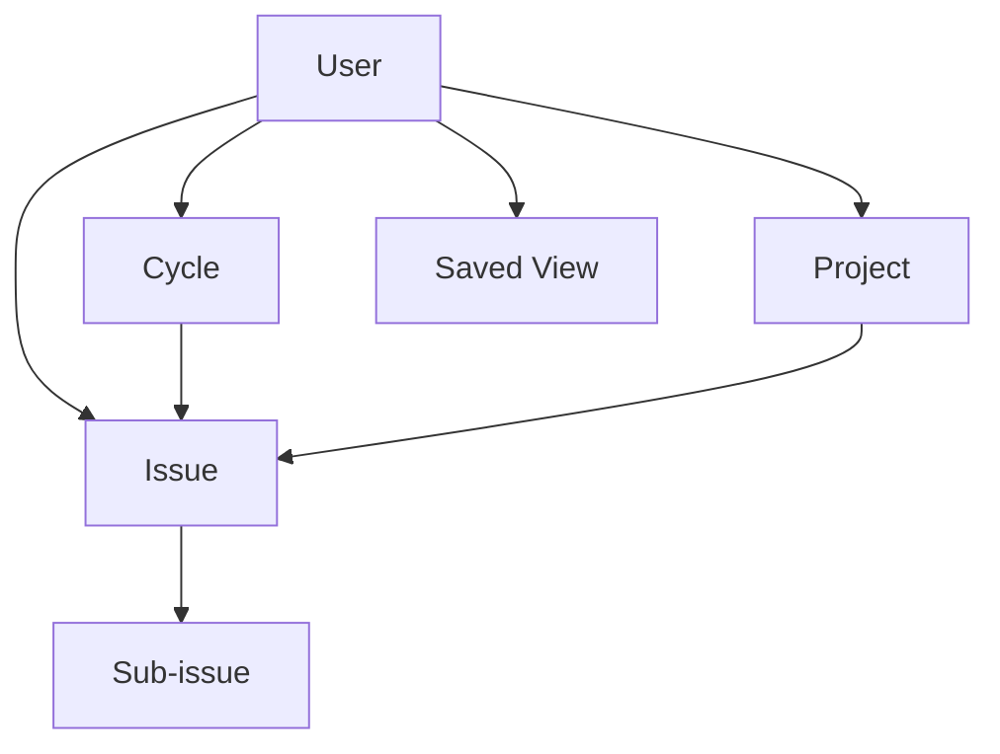

# Linearライク・プロジェクト管理アプリ 要件定義書

版・作成日・想定スタックなどの文書メタデータは、[要件定義の入口](./index.md)で一元管理する。

## 1. 文書の目的

Linearの機能体系と操作思想を参考に、PC・スマートフォン・タブレットのすべてで高速かつ扱いやすいプロジェクト管理アプリを自作するための要件、優先順位、受入条件、技術構成を定義する。

本書は「Linearの完全な複製」ではなく、以下を満たす実用的な初期プロダクトを対象とする。

1. Issueを中心に日々の作業を管理できる
2. Cycleで一定期間の作業計画と振り返りができる
3. Projectで複数Issueを成果物単位に束ねられる
4. PCではキーボード中心、モバイルではタッチ中心に快適に操作できる
5. Cloudflare上で低運用負荷・低コストに提供できる
6. 将来、リアルタイム更新、外部連携、AIへ拡張できる

## 2. 調査結果の要約

Linearの概念モデルは、Issueを最小の作業単位とし、Teamがワークフローを所有し、Cycleが短期計画、Projectが成果物、Initiativeが複数Projectを束ねる上位目標、Viewが横断的な閲覧方法を担う構造である。[Linear Concepts](https://linear.app/docs/conceptual-model) 本アプリでは一人運用に合わせてTeamとWorkspaceを取り除き、WorkflowとCycleをユーザーへ直接所属させる。

Linearらしさを作っている要素は、単なるカンバンではなく次の組み合わせである。

- Issue作成・編集がどの画面からでも速い
- ListとBoardを即座に切り替えられる
- Filter、Group、Order、表示項目を組み合わせ、Viewとして保存できる
- キーボードショートカット、コマンドメニュー、一括選択・一括操作が主要導線になっている
- 楽観的更新（サーバー応答前にUIへ反映する方式）により操作待ちを感じさせない
- Cycleが反復スケジュール、自動生成、繰越、クールダウン、進捗グラフまで含む
- モバイルはPC画面の縮小ではなく、Home・Inbox・Create・Searchを中心に再構成されている

LinearのCycleは1〜8週間、曜日・タイムゾーン・クールダウン・最大15件の将来Cycleを設定でき、未完了Issueは原則として次Cycleへ自動繰越される。[Linear Cycles](https://linear.app/docs/use-cycles)

## 3. プロダクト定義

### 3.1 プロダクトビジョン

個人開発者が、「次に何をするか」「今Cycleでどこまで進んだか」「Projectが予定どおりか」を、端末を問わず数秒で把握・更新できる個人専用プロジェクト管理アプリを提供する。

### 3.2 解決する課題

- タスクの登録や属性変更に手数がかかり、管理が後回しになる
- スプリント管理が重く、計画や振り返りのための事務作業が増える
- PC向け管理画面がスマートフォンで操作しづらい
- List、Board、検索結果で同じ情報の見え方や操作方法が揃っていない
- よく使うFilterや表示方法を毎回作り直す必要がある

### 3.3 対象ユーザー

| ペルソナ | 主な目的 | 主な端末 |
| --- | --- | --- |
| 個人開発者 | Backlog整理、Cycle計画、進捗把握、Project管理 | PC、スマートフォン、タブレット |

### 3.4 初期前提

- 利用者本人だけがアクセスできる個人専用アプリとする
- Team、Workspace、メンバー、招待、Role、担当者の概念は持たない
- 日本語と英語を保存可能とし、初期UI言語は日本語とする
- WebアプリおよびPWA（インストール可能なWebアプリ）として提供し、ネイティブアプリは作らない
- CycleとWorkflowはユーザーに対して1系統とする
- 1 IssueはProjectとCycleにそれぞれ最大1件所属する
- MVPではCycle境界処理・将来Cycle生成をCron Trigger（毎時）とSettingsの手動実行の両方から起動し、論理削除データのPurge、Outbox再送などのバックグラウンド処理はSettingsの手動実行から起動する。いずれもD1を一定件数ずつ処理する。外部メッセージ基盤は導入しない

## 4. スコープと優先順位

優先度は Must / Should / Could / Won't（今回対象外）で表す。

### 4.1 MVP（初期リリース）

| 領域 | 要件 | 優先度 |
| --- | --- | --- |
| 認証 | Cloudflare Accessによる本人限定認証、ログアウト、セッション失効時の再認証 | Must |
| 個人設定 | タイムゾーン、UI言語、Workflow、Cycle、テーマ設定 | Must |
| Issue | CRUD、状態、優先度、期限、Label、Project、Cycle | Must |
| Issue | 親子Issue、メモ、活動履歴、関連Issue | Should |
| Cycle | 反復設定、Cron Triggerまたは手動実行による生成・計画・繰越、進捗、履歴 | Must |
| Background processing | 手動RunによるCycle処理、Purge、Outbox再送、実行中の操作ロック・進捗・復旧。Cycle境界処理はCron Triggerからも起動 | Must |
| Project | CRUD、状態、期間、Issue一覧、進捗 | Must |
| View | List / Board、Filter、Group、Order、保存View | Must |
| 操作 | コマンドメニュー、主要ショートカット、一括操作 | Must |
| 検索 | Issue ID・タイトル・説明の検索、属性絞り込み | Must |
| Inbox | アプリ内通知、既読、削除、遷移 | Should |
| UI | PC・スマホ・タブレット対応、ライト/ダーク | Must |
| PWA | ホーム画面追加、Manifest・version付きJS / CSS / Icon等の公開静的AssetのCache | Should |
| 監査 | 主要エンティティの変更履歴 | Must |

### 4.2 Phase 2

ここでのPhase 2 / Phase 3は機能スコープ上の区分であり、実装フェーズ表のPhase 0〜6とは別軸である。外部メッセージ基盤は今回の対象外とする。

- InitiativeとロードマップTimeline
- Triage（外部連携から来たIssue候補の受け入れキュー）
- Issueテンプレート、Projectテンプレート
- 添付ファイル（Cloudflare R2）
- 通知スヌーズ、繰り返しReminder
- Webhook、公開API、GitHub / Slack連携
- CSV import / export
- CycleおよびProjectの高度な分析
- 外部メッセージ基盤、Webhook配送（今回対象外）。Cycle境界処理のCron Triggerと、所有者本人へのメール通知（Cloudflareの`send_email` binding）は対象内
- 完全なリアルタイム更新（Phase 2候補。導入要否は利用実績で判断）
- オフラインでのIssue作成・編集と再同期

### 4.3 Phase 3

- AIによるIssue分解、要約、重複候補、Cycle提案
- Customer Requests、SLA、Dashboard
- 高度な自動化、監査ログExport
- ネイティブモバイルアプリ

## 5. 情報構造

主要ナビゲーションは以下とする。

- Home
- Inbox
- Search
- Issues
- Cycles
- Projects
- Views
- Settings
