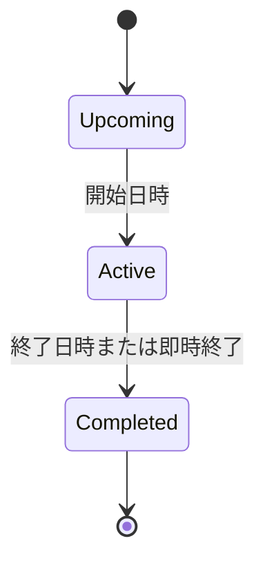

# 6. 機能要件

## 6.1 認証・本人限定アクセス

以下のAUTH-01〜06とAccessログアウト・再認証要件はクラウド運用に適用する。ローカル専用モードはCloudflare Accessを使わず、通常は同じPCの`http://127.0.0.1:3000`から固定Owner `local-owner`として利用する。ユーザーが`--lan`を指定した場合は、起動時に検出したLAN IPv4からも同じOwnerで利用できる。APIのHost / URLとMutationのOriginを検証し、外部Host・別Originを拒否する。固定Ownerはリクエストで変更できない。local設定をproduction認証の代替として使わない。

ローカル専用モードでも以下の業務機能・所有者境界・Run所有者照合は維持する。端末ごとのDB同期は対象外。LANアクセスは明示起動した同じローカルDBの共有として扱う。初回は既定Workflow等のみを用意し、デモIssueは作成しない。[ローカル利用手順](../local-development.md)に初期化と保存方法を定める。

| ID | 要件 | 受入条件 |
| --- | --- | --- |
| AUTH-01 | Cloudflare Access経由でメールOTPまたはGoogle認証できる | Access Policyで許可された1つのメールアドレスだけが認証成功する |
| AUTH-02 | Cloudflare Accessのセッションで本人確認を維持する | HTTPリクエストごとにWorkerが`Cf-Access-Jwt-Assertion`の署名・issuer・audienceを検証し、対応する所有者だけを許可する |
| AUTH-03 | 未認証アクセスとセッション失効をCloudflare Accessの再認証へ戻す | 通常NavigationはAccessがWorker到達前に保護し、Server Function / APIは失効時の401を検知して現在URLへTop-level Navigationする |
| AUTH-04 | 許可メールアドレスをAccess Policyで管理する | App側のClient bundleやログへ値を露出しない |
| AUTH-05 | SPA / PWAでAccessのセッション失効を回復できる | 同一Originの非同期リクエストへ`X-Requested-With: XMLHttpRequest`と`credentials: 'same-origin'`を付け、401をOffline・Timeout・5xxと区別し、再認証後に元のDeep linkへ戻る |
| AUTH-06 | 手動Runnerでも唯一の所有者を安全に解決する | Access JWTで認証した所有者の`user_id`をRunへ保存し、Chunk実行ごとに同じ所有者を検証する。未認証、所有者不一致、Runのuser_id不一致は外部応答を404または401にして業務データを更新せず、内部Security logだけへ記録する |

Cloudflare Accessの認証画面はアプリ内Routeではない。ログアウトは`/cdn-cgi/access/logout`へのTop-level Navigationで行う。Service Workerは静的公開AssetだけをCacheし、認証済みSSR HTML、Server Function / API応答、Accessの401・Redirect・Login応答、個人データをCacheしない。[Cloudflare Access session management](https://developers.cloudflare.com/cloudflare-one/access-controls/access-settings/session-management/) [Cloudflare Access authorization cookie](https://developers.cloudflare.com/cloudflare-one/access-controls/applications/http-apps/authorization-cookie/)

## 6.2 個人設定・Workflow

| ID | 要件 | 受入条件 |
| --- | --- | --- |
| PREF-01 | タイムゾーン、UI言語、表示モード、カラーテーマを設定できる | タイムゾーンはCycle境界と日時表示、UI言語は画面文言と日時・数値形式、表示モードとカラーテーマは配色へ反映される。表示モードはLight / Dark / System、カラーテーマはCoral / Ocean / Violet / Forest / Amberから選択し、初期値はCoralとする。MVPのUI言語は日本語・英語、初期値は日本語とする |
| PREF-02 | Issue番号を`TASK-123`形式で一意かつ単調増加に採番する | 同時作成でも重複しない |
| PREF-03 | Estimateは現行UIでは提供しない | 既存の`estimateEnabled`設定とIssue値は保存・API互換のため保持するが、新規UIの入力・Filter・Order・集計では使用しない |
| WF-01 | Workflow状態を設定できる | Backlog / Unstarted / Started / Completed / Canceledのカテゴリを持つ |
| WF-02 | 状態の名称、色、順序、既定値を変更できる | ユーザーごとの既定状態を常に1件だけ保ち、既存Issueとの整合性を保ったまま変更できる |
| WF-03 | Workflow状態を削除できる | 参照するIssueがある状態と既定状態の削除を拒否し、先にIssueの一括変更または別の既定状態の選択を求める |

## 6.3 Issue

LinearではIssueはTeamに必ず属するが、本アプリはTeamを持たない。タイトルと状態を必須、それ以外を任意とする点は踏襲する。[Linear Create issues](https://linear.app/docs/creating-issues)

| ID | 要件 | 受入条件 |
| --- | --- | --- |
| ISS-01 | どの主要画面からでもIssueを作成できる | PCは`C`、モバイルは中央の作成ボタンから2操作以内でComposerが開く |
| ISS-02 | Issueはtitle、description、statusを持つ | titleは1〜255文字、descriptionはMarkdown互換Rich Textである |
| ISS-03 | priority、due dateを設定できる | 未設定を許容し、一覧からインライン更新できる。期限は時刻を持たない日付とし、Timezoneを変更しても指定日を維持する。今日・期限超過・近日は本人Timezoneの現在日付と比較する。既存Estimate値はAPI互換のため保持するが、現行UIでは扱わない |
| ISS-04 | priorityはNo priority / Low / Medium / High / Urgentを持つ | 表示、Filter、Group、Orderで同じ定義を使う |
| ISS-05 | Labelを複数付与できる | Labelは名前と色を持つ |
| ISS-06 | Issueを最大1 Project、最大1 Cycleへ割り当てられる | ProjectとCycleの存在および本人所有を検証する |
| ISS-07 | Issue詳細をモーダルと専用URLの両方で開ける | URL共有時は同じIssueを直接開ける |
| ISS-08 | title、description、主要属性をインライン編集できる | 保存成功前にUIへ反映し、失敗時は戻して通知する |
| ISS-09 | 複数Issueを選択して一括更新できる | status、priority、cycle、project、labelに対応する |
| ISS-10 | 手動並び替えができる | 同一Group内でドラッグまたはキーボード操作により順序を保存する |
| ISS-11 | 親IssueとSub-issueを設定できる | 循環参照を禁止し、親子の進捗を表示する |
| ISS-12 | blocking / blocked by / related / duplicateを設定できる | 依存関係は双方向から確認できる |
| ISS-13 | 作業メモを追記・編集・削除できる | Markdownとコードブロックを扱える |
| ISS-14 | 変更履歴を時系列表示する | 作成、属性変更、メモ、アーカイブを時刻付きで記録する |
| ISS-15 | Issueをアーカイブ・復元・論理削除できる | 通常Viewから除外し、ArchiveはIssuesのArchived Filter、論理削除はTrashから復元できる |

Issueの依存関係はLinearのblocking、related、duplicateを踏襲する。[Linear Issue relations](https://linear.app/docs/issue-relations)

## 6.4 Cycle（最重要要件）

### 6.4.1 Cycle設定

| ID | 要件 | 受入条件 |
| --- | --- | --- |
| CYC-01 | Cycleを有効化できる | 無効化しても過去Cycleは保持される |
| CYC-02 | 期間を1〜8週間で設定できる | 個人設定のタイムゾーン基準で開始・終了する |
| CYC-03 | 開始曜日を設定できる | 開始日の00:00を境界とする |
| CYC-04 | Cycle間のCooldownを0〜4週間で設定できる | Cooldown中はActive Cycleが存在しない。Upcoming Cycleへの計画割当と手動Runによる繰越は許可するが、現在Cycleへの割当は行わない |
| CYC-05 | 将来Cycleの生成数を1〜15件で設定できる | 設定変更時に不足分を保留として表示し、手動Runで生成する |
| CYC-06 | 将来Cycleの開始日・終了日を個別調整できる | 過去Cycleは変更不可、期間重複を禁止し、個別調整したCycleは`schedule_overridden = true`として自動再生成の上書き対象外にする |

### 6.4.2 Cycleライフサイクル

CooldownはCycle自身の状態ではなく、前Cycleの終了から次Cycleの開始までActive Cycleが存在しない期間を表す。

| ID | 要件 | 受入条件 |
| --- | --- | --- |
| CYC-07 | Cycle状態をUpcoming / Active / Completedで自動判定する | 個人設定のタイムゾーンで境界を一貫して扱う |
| CYC-08 | 次Cycleを即時開始できる | 確認後、同じ条件付きCAS方式で現在Cycleを即時終了し、次Cycleの`starts_at`を現在時刻、`ends_at`を設定期間後へ変更してActiveにする。後続の将来Cycleは新しい境界から再計算し、個別調整済みCycleと重複する場合は更新を拒否して解消を求める |
| CYC-09 | Active終了時に未完了Issueを次Cycleへ繰り越す | Workflow categoryがUnstartedまたはStartedのIssueだけを次Cycleへ移し、Backlog / Completed / Canceledは元Cycleに残す |
| CYC-10 | StartedまたはCompletedになった未所属Issueを現在Cycleへ自動追加できる | 個人設定でON/OFFでき、変更履歴にAutomationとして記録する |
| CYC-11 | Issueが繰り越された回数と元Cycleを保持する | Issue詳細およびCycle履歴から追跡できる |
| CYC-12 | Cycle終了処理を冪等に実行する | 手動Run再実行・同時実行・CYC-08との競合でも、条件付きUPDATEの勝者だけが処理し、重複Cycle・重複履歴・二重繰越・重複Outboxが発生しない |

### 6.4.3 Cycle画面・分析

| ID | 要件 | 受入条件 |
| --- | --- | --- |
| CYC-13 | Current / Upcoming / Pastを切り替えられる | PC、タブレット、スマホで同じ情報へ到達できる。Cooldown中のCurrentは「Active Cycleなし」、次回開始時刻、Upcoming Cycleへの導線を表示する |
| CYC-14 | CycleへIssueを追加・削除・並び替えできる | ListとBoardの両方から更新できる |
| CYC-15 | Scopeと完了率をIssue数で表示する | Canceled Issueを完了率の分母から除外する |
| CYC-16 | 日別のCompleted、Remaining、Scope changeを表示する | Cycle開始時点と追加・削除の差分を再現できる |
| CYC-17 | 状態・優先度・Project別の内訳を表示する | Issue数を表示する |
| CYC-18 | Cycle名と説明を編集できる | 自動生成名とは別に任意の上書き名とRich Text説明を保存し、上書き名を解除すると自動生成名へ戻る |

## 6.5 Project

LinearのProjectは明確な成果または目標日を持つ作業単位で、Issue、概要、文書、マイルストーン、進捗を束ねる。[Linear Projects](https://linear.app/docs/projects)

| ID | 要件 | 受入条件 |
| --- | --- | --- |
| PRJ-01 | Projectを作成・編集・アーカイブ・復元できる | name以外は任意とし、Archived Filterから復元できる |
| PRJ-02 | status、priority、色、アイコンを設定できる | 一覧とIssue pickerに同じ表現を使う |
| PRJ-03 | start dateとtarget dateを設定できる | 日・月・四半期の入力粒度を日付とは別に保持し、元の精度で再表示できる |
| PRJ-04 | Project IssueをList / Boardで表示する | Filter、Group、Order、保存Viewに対応する |
| PRJ-05 | 完了率をIssue数で表示する | canceled Issueを母数から除外する |
| PRJ-06 | Project詳細に概要、説明、プロパティ、Issue、進捗を表示する | タブまたはモバイル向けセクションで切り替えられる |
| PRJ-07 | Project statusを手動更新する | Backlog / Planned / In Progress / Completed / Canceledカテゴリを持つ |
| PRJ-08 | Project statusの名称、色、順序、既定値を設定できる | ユーザーごとの既定値を1件だけ保ち、参照中または既定の状態は削除を拒否して、先にProjectの一括変更または別の既定値の選択を求める |
| PRJ-09 | Project詳細のIssue表示設定を保存・同期できる | List / Board、検索、Status / Priority / Label / 期限Filter、並び順、完了Issue表示切替をProjectごとに保存し、別端末でも復元できる |

## 6.6 View・Filter・Board

LinearはList / Boardの切替、Group、Order、表示項目をDisplay optionsとして保持し、Filter済み画面をCustom Viewとして保存できる。[Linear Display options](https://linear.app/docs/display-options) [Linear Custom Views](https://linear.app/docs/custom-views)

| ID | 要件 | 受入条件 |
| --- | --- | --- |
| VIEW-01 | Issue一覧をList / Boardで切り替えられる | 同じFilter条件と選択状態を維持する |
| VIEW-02 | status、priority、label、project、cycle、due date、created dateでFilterできる | 複数条件のANDをMVPで提供する |
| VIEW-03 | status、priority、project、cycle、labelでGroup化できる | 空Groupの表示/非表示を切り替えられる |
| VIEW-04 | manual、priority、updated、created、due dateでOrderできる | OrderはListとBoardで共有する。既存Estimate順はAPI互換のため保持するが、現行UIでは選択肢に出さない |
| VIEW-05 | 表示プロパティを選択できる | 全体の既定値を個人設定へ保存し、Saved Viewでは`layout_json`の値を優先する |
| VIEW-06 | Filter・Group・Order・LayoutをViewとして保存できる | 名前を付けて追加・編集・削除できる |
| VIEW-07 | Filter条件をURLへ反映する | URL共有で主要Filterを再現できる |
| VIEW-08 | PCで複数Issueを選択できる | Shift範囲選択、全選択、Esc解除に対応する |

高度なAND / OR・入れ子FilterはPhase 2とする。Linearの高度なFilterはAND / ORと入れ子条件をサポートしている。[Linear Filters](https://linear.app/docs/filters)

## 6.7 Search・Command menu・ショートカット

| ID | 要件 | 受入条件 |
| --- | --- | --- |
| NAV-01 | 全体検索でIssue ID、title、descriptionを検索できる | 300ms以内のデバウンス、属性Filter、キーボード選択に対応する |
| NAV-02 | 最近開いたIssueと最近の検索を表示する | D1へ種別ごとに最大20件保存して端末間同期し、同一対象・同一検索条件は最新時刻へ更新する。削除済みIssueは表示しない |
| NAV-03 | `Cmd/Ctrl + K`でCommand menuを開ける | ナビゲーション、作成、選択中Issueの操作を検索できる |
| NAV-04 | 単一キーショートカットを提供する | 入力欄フォーカス中は発火しない |
| NAV-05 | ショートカット一覧を表示できる | `?`で開き、OSに応じたキー表記をする |

MVP推奨ショートカット:

| キー | 操作 |
| --- | --- |
| `C` | Issue作成 |
| `Cmd/Ctrl + K` | Command menu |
| `Cmd/Ctrl + F` | 現在View内検索 |
| `F` | Filter |
| `Shift + V` | Display options |
| `Cmd/Ctrl + B` | List / Board切替 |
| `X` | Issue選択 |
| `Esc` | 閉じる / 選択解除 |

## 6.8 Inbox・通知

| ID | 要件 | 受入条件 |
| --- | --- | --- |
| NOTIF-01 | 期限接近、期限超過、Cycle開始・終了、自動処理失敗をInboxへ通知する | 種別、対象、時刻、既読状態を持つ |
| NOTIF-02 | 通知を既読・未読・削除できる | 複数端末間で状態が同期する |
| NOTIF-03 | 通知から対象Issue、Cycleまたは関連画面へ移動できる | モバイルでは戻る操作でInbox位置を復元する |
| NOTIF-04 | 通知種別ごとにON/OFFできる | ユーザー設定へ保存する |

## 6.9 Settings・監査・データ管理

- Profile、Workflow、Cycle、Label、Project status、通知、テーマ、Background processingを設定できる
- 業務データの作成・更新・削除は、actor、action、entity、before/after差分、request ID、timestampを記録する
- JSONまたはCSVでIssueをExportできる（Phase 2）
- Issue、Project、通知、メモ、Saved Viewの削除は原則論理削除とし、Trashから30日以内に復元できる
- `deleted_at`から30日を超えたデータは、MVPでは手動RunがD1をChunk処理して依存データとともに物理削除する。Jobは冪等とし、実行結果を監査イベントへ記録する
- Mutation receiptは作成から30日後を`expires_at`とし、MVPでは手動RunがD1をChunk処理して物理削除する。`expires_at`は削除対象になる時刻であり、期限到達後も物理削除までは同じ`idempotencyKey`を予約して保存済み応答またはKey再利用エラーを返す。削除後は新しいMutationとして扱う
- D1 Time TravelおよびBackup上の保持は、アプリ内の30日復元期限には含めない

## 6.10 バックグラウンド処理

| ID | 要件 | 受入条件 |
| --- | --- | --- |
| ASYNC-01 | バックグラウンド処理をSettingsから手動実行できる | 公開Run種別は`maintenance`に固定し、固定Stepを`cycle_transition`（Cycle境界処理・将来Cycle生成）→ `purge` → `outbox_retry`の順に処理する。各Chunkは最大`CHUNK_SIZE`件で、`cursor`と進捗を保存して次のHTTP呼び出しへ返す |
| ASYNC-02 | バックグラウンド処理の実行中は業務操作を停止する | Issue（CRUD、Notes、Relation、Label、Archive、Trash、Restore、Bulk）、Cycle、Project、View、Notification、Preference、Workflow、Project statusなど全業務Mutationを`code = OPERATION_IN_PROGRESS`と`requestId`付きの423で拒否し、version、Activity、Outbox、Mutation receiptを増やさない。Run継続・状態取得・復旧、進捗取得、再認証、ログアウト、読み取りは許可する。画面はフルスクリーンの処理中表示にする |
| ASYNC-03 | 実行状態と進捗を端末横断で確認できる | `pending / running / paused / succeeded / failed / rejected`を保持し、`GET /current`で再読み込み・別端末から同じ`run_id`、Step、cursor、進捗を表示する。cursorはServer生成のopaque stringとし、比較はcursor値ではなくD1のversion / 状態遷移で行う。Lease期限切れは`paused`へ遷移し、古いChunk実行は書き込みできない |
| ASYNC-04 | 手動RunをHTTP Chunk実行で継続できる | `POST /api/v1/background-runs`でRunを作成し、`POST /api/v1/background-runs/:id/continue`へ現在の`expected_cursor`を渡してブラウザが完了まで呼び出す。各呼び出しはD1 `batch()`で1 Chunkだけ処理し、Heartbeatを更新する。古いcursorの敗者は現在進捗を返して効果を発生させない。外部メッセージ基盤・自動スケジューラ・常駐Workerを必要としない |
| ASYNC-05 | Chunk処理を冪等に再実行できる | 同じRun・Step・cursorの再送や同時実行でも一度だけ反映し、`background_effect_dedupes`で業務効果を重複させない。Chunkの順序、user_id、Run所有者、lock token、LeaseをServer側で検証する。Run所有者不一致・不存在は404、paused / failed Runへのcontinueは409 `RUN_REQUIRES_RESUME`、有効Runへの競合Mutationは423 `OPERATION_IN_PROGRESS`とする |
| ASYNC-06 | ブラウザ終了・失敗後に安全に再開できる | Heartbeatが止まるとRunを`paused`にしてLockを解放し、再度開いた画面から同じRunをcursor位置から再開する。Step失敗は`failed`として再開対象にし、成功済みStep・ChunkはNo-op、terminal状態からの逆戻りは禁止する |
