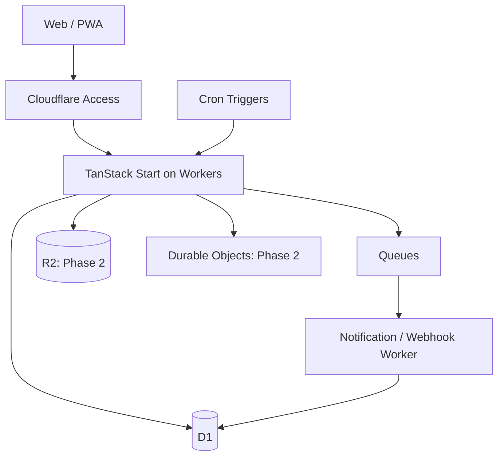

# 9. 技術選定

## 9.1 推奨スタック

| レイヤー | 採用技術 | 採用理由 |
| --- | --- | --- |
| 言語 | TypeScript（strict） | フロントからWorkerまで型を統一できる |
| Full-stack | TanStack Start + React | Router中心、SSR、Server Functions、型安全なルーティングを利用できる |
| Build / Deploy | Vite + `@cloudflare/vite-plugin` + Wrangler | TanStack公式のCloudflare Workers構成である |
| UI | Tailwind CSS + shadcn/ui（Base UI） | デザインを所有しつつAccessibleなPrimitiveを利用できる |
| Data fetching | TanStack Query | Cache、Mutation、楽観的更新、再取得制御に強い |
| Form | TanStack Form + Zod | 複雑な編集フォームと型付きValidationに対応する |
| Table / List | TanStack Table + TanStack Virtual | 高密度Listと大量行の仮想化に向く |
| Drag & Drop | dnd-kit系のReact対応ライブラリ | Pointer / Touch / Keyboard Sensorを統一しやすい |
| Rich text | Tiptap（ProseMirror） | Markdown互換の拡張可能なIssue Editorを作りやすい |
| i18n | i18next + react-i18next | 日本語・英語の辞書とSSR / Clientで一貫したLocale解決を扱える |
| DB | Cloudflare D1 | リレーショナルなIssue管理に適し、Worker Bindingで運用負荷が低い |
| ORM | Drizzle ORM + Drizzle Kit | D1を正式サポートし、型安全SQLとMigrationを扱える |
| Auth | Cloudflare Access | 一人専用のためApp内にUser・Session・招待機能を実装せず、メールAllow policyで保護できる |
| Async | Cloudflare Queues | 通知生成、Webhook、集計更新をRequestから分離できる |
| Scheduler | Workers Cron Triggers | Cycle開始・終了・将来Cycle生成、論理削除データのPurge、Outbox再送を定期実行できる |
| Realtime | Durable Objects + WebSocket（Phase 2・任意） | PCとモバイル間の即時Push更新に向く |
| File | Cloudflare R2（Phase 2） | 添付ファイルをDBと分離できる |
| Test | Vitest + Playwright + MSW | Unit / Integrationを一次担保とし、外部I/O Mockと少数の実Browser Smokeを分担できる |
| Quality | ESLint + Prettier + TypeScript + Lefthook | 静的検査とローカル品質ゲートを統一する |
| Observability | Workers Logs + OpenTelemetry互換の外部Sink | 構造化ログと分散追跡へ拡張できる |

TanStack Startは2026-08-23時点でRC表記であるため、本番採用は可能でも破壊的変更リスクを受け入れる必要がある。一方、Cloudflare Workersは公式PartnerとしてVite Pluginを使う手順が提供されている。[TanStack Start](https://tanstack.com/start/latest) [TanStack Start Hosting](https://tanstack.com/start/latest/docs/framework/react/guide/hosting)

Drizzle ORMはCloudflare D1とWorkers環境を正式にサポートする。[Drizzle D1](https://orm.drizzle.team/docs/sqlite/connect-cloudflare-d1) shadcn/uiにもTanStack Start向けセットアップがある。[shadcn TanStack Start](https://ui.shadcn.com/docs/installation/tanstack)

一人運用では認証ライブラリを導入するより、Cloudflare AccessのSelf-hosted applicationとしてWorker全体を保護し、本人のメールアドレスだけをAllowする方が実装・攻撃面・運用を小さくできる。Access通過後もWorkerで署名済みJWTを検証する。[Cloudflare Access policies](https://developers.cloudflare.com/cloudflare-one/access-controls/policies/) [Validate Access JWT](https://developers.cloudflare.com/cloudflare-one/access-controls/applications/http-apps/authorization-cookie/validating-json/)

## 9.2 Cloudflare構成



### 構成判断

- 主データはD1に集約する。D1は管理DBとしてMigration、Import / Export、Query insightsを備える。一方、Durable Objects SQLiteは強整合な状態と計算を同一場所に置けるが、初期構築の複雑性が増すため、MVPの主DBにはしない。[Cloudflare storage options](https://developers.cloudflare.com/workers/platform/storage-options/)
- RealtimeはMVPでポーリング/再検証に留める。Phase 2では利用実績に基づいて導入要否を判断し、導入する場合は複数Clientの状態調停とWebSocketに適するDurable Objectsを使用する。[Cloudflare Durable Objects](https://developers.cloudflare.com/durable-objects/)
- 通知、Webhook、重い集計はQueuesへ送り、API応答時間と再試行性を確保する。Queuesは保証付き配送、Batch、Retry、Delayに対応する。[Cloudflare Queues](https://developers.cloudflare.com/queues/)
- D1 Read Replicationを有効にする場合はSessions APIとBookmarkを用い、同一Browser session内のsequential consistency（順序一貫性）を確保する。[D1 read replication](https://developers.cloudflare.com/d1/best-practices/read-replication/)
- HTTP Handlerは検証済みAccess JWTのemailが`OWNER_USER_ID`に対応する`users.email`と一致する場合だけ所有者を返す。CronはWorker環境変数`OWNER_USER_ID`を使い、Queue Messageはproducerが確定した`user_id`と`event_id`を持たせ、consumerで`OWNER_USER_ID`との一致を検証する。Cron / Queueのactorは`system:cron` / `system:queue`として監査へ記録する。[Workers Scheduled handler](https://developers.cloudflare.com/workers/runtime-apis/handlers/scheduled/) [Queues consumers](https://developers.cloudflare.com/queues/reference/how-queues-works/)
- 初回Deploy時にUUID v7の唯一の`users`行をBootstrapし、そのIDを`OWNER_USER_ID`へ設定する。Binding未設定、UUID不正、対応行なし、Access JWTの本人識別子が所有者と対応しない場合はFail closedとする。
- Queueは再配送を前提とし、D1 Outboxを配送状態の正本にする。Queue保持期限へ依存せず、未完了EventをCronから再投入できるようにする。
- Accessセッション失効時は共通Fetch層で401を検知し、Client Routerではなく現在URLをTop-levelで再読込する。Window focus復帰時・Network再接続時・30秒周期にもServer stateを再検証する。

## 9.3 API方針

- 画面内呼び出し: TanStack Start Server Functions
- 外部連携・Webhook・将来Public API: `/api/v1` Server Routes
- Validation: 入出力ともZod Schema
- Error: `code`, `message`, `fieldErrors`, `requestId`の統一Envelope
- Mutation: 全Mutationが`idempotencyKey`を受け取り、Issue更新は追加でentity `version`を受け取る
- Mutationの事前読取: D1 Read Replication有効時は`withSession('first-primary')`を使い、条件付きUPDATEのCASを最終判定とする
- Pagination: cursor方式
- D1アクセス: Server側のみ。BrowserへBindingやTokenを露出しない

## 9.4 フロントエンド状態管理

- Server state: TanStack Query
- URL state: TanStack Routerのsearch params
- Form state: TanStack Form
- Local UI state: React state / context
- 永続的な個人表示設定: DB。ただし一時的な開閉状態はlocalStorage
- 最近開いたIssueと最近の検索: D1へ保存して端末間同期。一時的な入力中QueryはURLまたはLocal UI state
- Redux等の包括的StoreはMVPで採用しない

TanStack QueryはMutation応答前にCacheを更新する楽観的更新を公式にサポートする。[TanStack Query optimistic updates](https://tanstack.com/query/latest/docs/framework/react/guides/optimistic-updates)

# 10. データモデル概要

すべての主キーはUUID v7または同等の時系列ソート可能IDを使用し、日時はUTCのUnix millisecondsで保存する。個人専用でも認証境界を明確にするため、主な業務テーブルは`user_id`を持つ。

| Entity | 主な属性 |
| --- | --- |
| users | id, name, email, avatar_url, created_at |
| user_preferences | user_id, timezone, locale, theme, issue_counter, estimate_enabled, default_issue_display_json |
| workflow_states | id, user_id, name, category, color, position, is_default |
| cycles | id, user_id, number, name_override, description_json, starts_at, ends_at, schedule_overridden, status, completed_at, completion_token |
| cycle_settings | user_id, enabled, duration_weeks, cooldown_weeks, start_weekday, future_count, auto_add_to_current_cycle |
| project_statuses | id, user_id, name, category, color, position, is_default |
| projects | id, user_id, name, status_id, priority, color, icon, description_json, start_at, start_precision, target_at, target_precision, archived_at, deleted_at |
| issues | id, user_id, number, title, description_json, description_text, status_id, priority, estimate, due_at, project_id, cycle_id, parent_id, position, version, last_mutation_key, archived_at, deleted_at, created_at, updated_at |
| labels | id, user_id, name, color |
| issue_labels | issue_id, label_id |
| issue_relations | source_issue_id, target_issue_id, type |
| issue_notes | id, issue_id, user_id, body_json, created_at, edited_at, deleted_at |
| cycle_issue_history | id, user_id, issue_id, from_cycle_id, to_cycle_id, reason, moved_at |
| saved_views | id, user_id, name, entity_type, query_json, layout_json, deleted_at |
| recent_issue_views | user_id, issue_id, viewed_at |
| recent_searches | id, user_id, normalized_query_json, searched_at |
| notifications | id, user_id, type, entity_type, entity_id, read_at, deleted_at, created_at |
| notification_preferences | user_id, notification_type, enabled |
| activity_events | id, user_id, actor_type, actor_id, entity_type, entity_id, action, request_id, mutation_key, before_json, after_json, created_at |
| outbox_events | id, user_id, event_id, type, payload_json, dedupe_key, status, attempt_count, available_at, created_at |
| mutation_receipts | id, user_id, idempotency_key, operation, request_hash, response_json, created_at, expires_at |

## 10.1 主要制約・Index

- `issues(user_id, number)` unique
- `issues(user_id, status_id, updated_at)`
- `issues(user_id, cycle_id, position)`
- `issues(user_id, project_id, status_id, position)`
- `notifications(user_id, read_at, created_at)`
- `activity_events(user_id, entity_type, entity_id, created_at)`
- `activity_events(user_id, mutation_key)` unique
- `cycles(user_id, number)` unique
- `cycle_issue_history(user_id, issue_id, from_cycle_id, to_cycle_id, reason)` unique
- `outbox_events(user_id, dedupe_key)` unique
- `mutation_receipts(user_id, idempotency_key)` unique
- `recent_issue_views(user_id, issue_id)` unique
- `recent_searches(user_id, normalized_query_json)` unique。`normalized_query_json`はKey順・既定値・空条件を正規化したCanonical JSONとする
- `workflow_states(user_id)`と`project_statuses(user_id)`は、それぞれ`is_default = true`を1件だけ許可する部分Unique Indexを持つ
- `workflow_states.category`はBacklog / Unstarted / Started / Completed / Canceled、`project_statuses.category`はBacklog / Planned / In Progress / Completed / Canceledだけを許可する
- 最近閲覧と最近の検索は上記Unique制約をConflict targetとしてUpsertし、種別ごとに新しい20件だけを保持する
- 親子Issueは同一ユーザー所有に限定し、再帰更新前に循環を検出する
- Relationは正規化した組み合わせに一意制約を置く
- Project、Cycle、Workflow state、Project status、Labelを参照する書き込みは、参照先が同じ`user_id`を持つことを検証する

検索はD1 SQLite FTS5を第一候補とし、Phase 0の品質・性能基準を満たした場合に採用してIssue番号、title、`description_text`を索引化する。Issue保存時にServer側でTiptap JSONから`description_text`を生成し、JSON・射影列・採用時のFTS Indexを同一書き込み処理で更新する。FTS Indexは再構築可能な派生データとして扱う。Phase 0ではtrigramを含むTokenizer、MATCH QueryのEscape、3文字未満のIssue ID・title Prefix検索、英日混在の検索品質、1万Issue時のLatencyとRows readを検証する。基準を満たさない場合も、title Prefixと`description_text`検索を組み合わせたFallbackでNAV-01を満たす。高度な全文検索は外部検索基盤を導入するまでPhase 2とする。[D1 supported SQLite extensions](https://developers.cloudflare.com/d1/sql-api/sql-statements/) [D1 index best practices](https://developers.cloudflare.com/d1/best-practices/use-indexes/)

# 11. 主要処理フロー

## 11.1 Issue更新

```ts
const updateIssue = createServerFn({ method: 'POST' })
  .inputValidator(updateIssueSchema)
  .handler(async ({ data, context }) => {
    const user = await requireAllowedUser(context)
    const requestHash = hashCanonicalRequest(data)
    const existing = await mutationReceiptRepo.find(user.id, data.idempotencyKey)
    if (existing) {
      if (existing.requestHash !== requestHash) {
        throw new ConflictError('IDEMPOTENCY_KEY_REUSED')
      }
      return existing.response
    }

    const current = await issueRepo.findOwnedBy(data.id, user.id)
    const next = buildUpdatedIssue(current, data)

    const [updated] = await db.batch([
      // UPDATE issues SET ..., version = version + 1, last_mutation_key = ?
      // WHERE id = ? AND user_id = ? AND version = ?
      //   AND NOT EXISTS (
      //     SELECT 1 FROM mutation_receipts
      //     WHERE user_id = ? AND idempotency_key = ?
      //   )
      issueRepo.updateByVersion(next),
      activityRepo.appendUniqueIfMutationMatches(
        buildIssueDiff(user, current, next),
        data.idempotencyKey,
      ),
      outboxRepo.enqueueUniqueIfMutationMatches(
        buildIssueUpdatedEvent(user, current, next),
        data.idempotencyKey,
      ),
      mutationReceiptRepo.recordIfMutationMatches(
        data.idempotencyKey,
        requestHash,
        buildMutationResponse(next),
      ),
    ])

    if (updated.meta.changes === 0) {
      const receipt = await mutationReceiptRepo.find(user.id, data.idempotencyKey)
      if (receipt?.requestHash === requestHash) return receipt.response
      if (receipt) throw new ConflictError('IDEMPOTENCY_KEY_REUSED')
      throw new ConflictError('ISSUE_VERSION_CONFLICT')
    }

    return next
  })
```

Version比較はWorker上の事前読取だけに依存せず、条件付きUPDATEをCASとして使う。同一`batch()`内のActivity、Outbox、Mutation receiptは`last_mutation_key`との一致でGuardし、各`mutation_key` / `dedupe_key` / `idempotency_key`のUnique制約で再送をNo-opにする。Request hashはMutationのoperation名と、`idempotencyKey`を除くValidation済みPayloadのCanonical表現から生成する。同じKey・同じRequest hashは保存済み応答を返し、同じKey・異なるRequestは409 `IDEMPOTENCY_KEY_REUSED`とする。クライアントは`onMutate`でCacheを先に更新し、409 Conflict時は最新Issueを取得して差分を提示する。

## 11.2 Cycle終了

```ts
async function closeCycle(
  cycleId: string,
  ownerUserId: string,
  now: Date,
  trigger: 'scheduled' | 'manual',
) {
  const completionToken = crypto.randomUUID()

  const [claimed] = await db.batch([
    // UPDATE cycles SET status = 'completed', completed_at = ?, completion_token = ?
    // WHERE id = ? AND user_id = ? AND status = 'active'
    //   AND (ends_at <= ? OR ? = 'manual')
    //   AND NOT EXISTS (manual再計算後に重複する個別調整済みCycle)
    cycleRepo.completeIfActive(
      cycleId,
      ownerUserId,
      now,
      trigger,
      completionToken,
    ),
    cycleRepo.ensureNextIfTokenMatches(cycleId, completionToken),
    cycleRepo.rescheduleAndActivateNextIfDueOrManualAndTokenMatches(
      cycleId,
      trigger,
      completionToken,
    ),
    cycleHistoryRepo.recordCandidatesIfTokenMatches(cycleId, completionToken),
    issueRepo.moveCandidatesIfTokenMatches(cycleId, completionToken),
    outboxRepo.enqueueUniqueIfTokenMatches(
      `cycle.completed:${cycleId}`,
      cycleId,
      completionToken,
    ),
  ])

  if (claimed.meta.changes === 0) return // 完了済み、期限前、または別Jobが勝利
}
```

`batch()`の結果を受け取るまで途中分岐できないため、後続SQLはすべて同じ`completion_token`の存在を条件にする。候補抽出は事前SELECTせず、`INSERT ... SELECT`と集合UPDATEで`user_id`、元`cycle_id`、Workflow categoryをbatch内で再評価する。手動即時開始では、次Cycleの日付変更と後続の自動生成Cycle再生成も同じTokenでGuardし、個別調整済みCycleとの重複がある場合は先頭CASを成立させない。次Cycle、繰越履歴、Outboxには一意制約を置く。Batch中の失敗はCASを含めてRollbackされるため、外部から遷移中状態は見えない。[D1 batch API](https://developers.cloudflare.com/d1/worker-api/d1-database/)

Cronは短い間隔で「境界を過ぎた未処理Cycle」を取得する。時刻ぴったりの1回だけに依存せず、状態遷移のCAS、一意制約、冪等な再実行で重複処理を吸収する。
