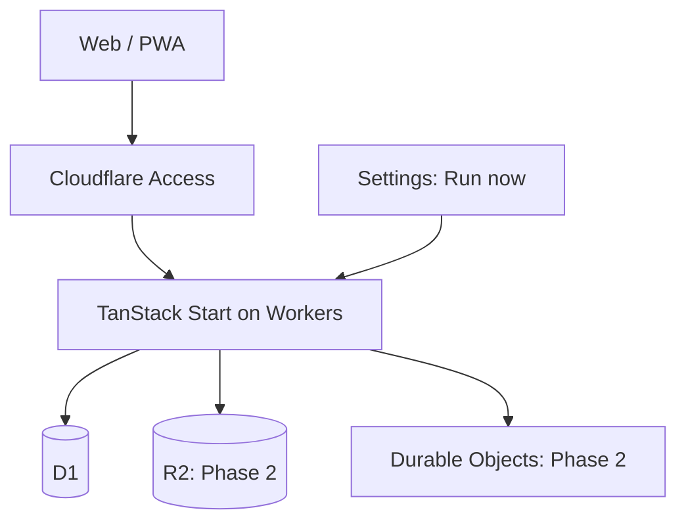
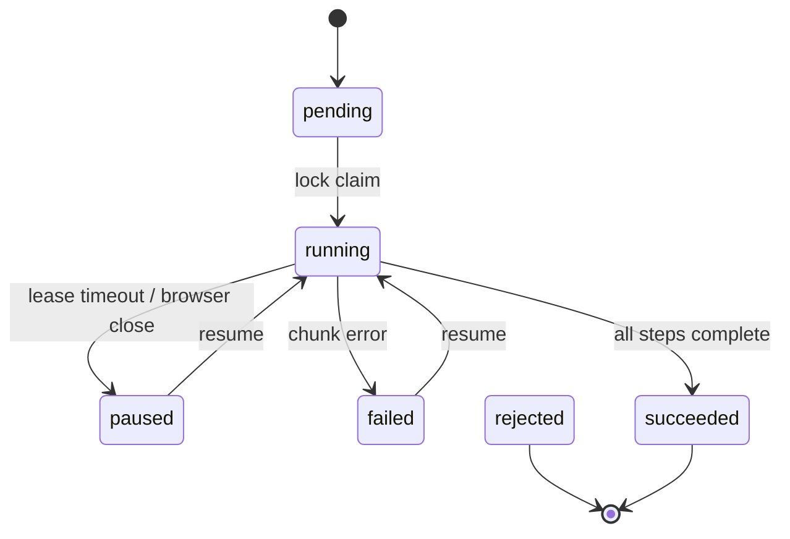

# 9. 技術選定

## 9.1 推奨スタック

| レイヤー | 採用技術 | 採用理由 |
| --- | --- | --- |
| 言語 | TypeScript（strict） | フロントからWorkerまで型を統一できる |
| Full-stack | TanStack Start + React | Router中心、SSR、Server Functions、型安全なルーティングを利用できる |
| Build / Deploy | Vite + `@cloudflare/vite-plugin` + Wrangler | TanStack公式のCloudflare Workers構成である |
| UI | Tailwind CSS + shadcn/ui（Base UI） | デザインを所有しつつAccessibleなPrimitiveを利用できる |
| Data fetching | TanStack Query | Cache、Mutation、楽観的更新、再取得制御に強い |
| Form | TanStack Form + Zod | 複雑な編集フォームと型付きValidationに対応する |
| Table / List | TanStack Table + TanStack Virtual | 高密度Listと大量行の仮想化に向く |
| Drag & Drop | dnd-kit系のReact対応ライブラリ | Pointer / Touch / Keyboard Sensorを統一しやすい |
| Rich text | Tiptap（ProseMirror） | Markdown互換の拡張可能なIssue Editorを作りやすい |
| i18n | i18next + react-i18next | 日本語・英語の辞書とSSR / Clientで一貫したLocale解決を扱える |
| DB | Cloudflare D1 | リレーショナルなIssue管理に適し、Worker Bindingで運用負荷が低い |
| ORM | Drizzle ORM + Drizzle Kit | D1を正式サポートし、型安全SQLとMigrationを扱える |
| Auth | Cloudflare Access | 一人専用のためApp内にUser・Session・招待機能を実装せず、メールAllow policyで保護できる |
| Package manager | pnpm | 依存導入・script実行・lockfileをpnpmへ統一する |
| Async | 手動HTTP Chunk Runner | MVPはSettingsのボタンからD1を一定件数ずつ処理し、cursorを返して次のHTTP呼び出しへ継続する。外部メッセージ基盤や常駐Consumerは使わない。Cycle境界処理はCron Triggerからも起動する |
| Scheduler | Cron Trigger（毎時0分 UTC） | WorkerのCron TriggerでCycle境界処理（補充・終了・繰越・開始）だけを自動実行する。PurgeとOutbox再送はユーザーの手動Runから起動する |
| Realtime | Durable Objects + WebSocket（Phase 2・任意） | PCとモバイル間の即時Push更新に向く |
| File | Cloudflare R2（Phase 2） | 添付ファイルをDBと分離できる |
| Test | Vitest + Playwright + MSW | Unit / Integrationを一次担保とし、外部I/O Mockと少数の実Browser Smokeを分担できる |
| Quality | oxlint + oxfmt + TypeScript + Lefthook | JavaScript / TypeScriptのlintとformatを高速に統一する |
| Observability | Workers Logs + OpenTelemetry互換の外部Sink | 構造化ログと分散追跡へ拡張できる |

TanStack Startは2026-08-23時点でRC表記であるため、本番採用は可能でも破壊的変更リスクを受け入れる必要がある。一方、Cloudflare Workersは公式PartnerとしてVite Pluginを使う手順が提供されている。[TanStack Start](https://tanstack.com/start/latest) [TanStack Start Hosting](https://tanstack.com/start/latest/docs/framework/react/guide/hosting)

Drizzle ORMはCloudflare D1とWorkers環境を正式にサポートする。[Drizzle D1](https://orm.drizzle.team/docs/sqlite/connect-cloudflare-d1) shadcn/uiにもTanStack Start向けセットアップがある。[shadcn TanStack Start](https://ui.shadcn.com/docs/installation/tanstack)

一人運用では認証ライブラリを導入するより、Cloudflare AccessのSelf-hosted applicationとしてWorker全体を保護し、本人のメールアドレスだけをAllowする方が実装・攻撃面・運用を小さくできる。Access通過後もWorkerで署名済みJWTを検証する。[Cloudflare Access policies](https://developers.cloudflare.com/cloudflare-one/access-controls/policies/) [Validate Access JWT](https://developers.cloudflare.com/cloudflare-one/access-controls/applications/http-apps/authorization-cookie/validating-json/)

## 9.2 Cloudflare構成

この構成図・Access認証・remote D1・外部ログ転送はクラウド運用に適用する。ローカル専用モードでは、同じアプリをCloudflareのローカル実行ツール上で動かし、ローカルD1を使う。クラウドアカウント・Access・外部ログ転送に依存しない。

ローカル専用モードは`APP_ENV=local` / `ORBIT_STORAGE=d1`と固定Owner `local-owner`を使い、既存MigrationとOwner単位のSnapshot / Version CASで永続化する。保存先はリポジトリ基準`.orbit/local`または`ORBIT_LOCAL_DATA_DIR`の絶対パスで、初期化・起動・バックアップに同じ解決値を使う。通常HTTPは`127.0.0.1:3000`固定。`--lan`時は0.0.0.0:3000で待ち受け、検出したRFC1918 IPv4とloopbackの許可OriginをWorkerへ設定する。UIのフォントを含め外部リソースを自動取得しない。DB欠落・破損・保存失敗をMemory Storeで隠さない。

既存`pnpm dev`のMemory Storeは画面開発用として維持する。Manual RunはlocalでもHTTP Chunk方式を使い、サーバー停止中は処理しない。バックアップは停止中に永続状態全体と版情報を保存し、同じコード・ツール版の空の別保存先へ復元する。詳細は[ローカル利用手順](../local-development.md)を参照する。



### 構成判断

- 主データはD1に集約する。D1は管理DBとしてMigration、Import / Export、Query insightsを備える。一方、Durable Objects SQLiteは強整合な状態と計算を同一場所に置けるが、初期構築の複雑性が増すため、MVPの主DBにはしない。[Cloudflare storage options](https://developers.cloudflare.com/workers/platform/storage-options/)
- MVPのバックグラウンド処理はSettingsの手動起動を入口とし、各HTTP呼び出しでD1を一定件数ずつ処理する。Serverはcursorと進捗を返し、ブラウザが次Chunkを継続呼び出しする。Cycle境界処理に限り、Cron Trigger（毎時）がWorkerの`scheduled`ハンドラから、Runを作らずLockも保存せずに1回の実行内でSnapshot読込・処理・Version CAS保存を行う。保存競合は最大3回再試行し、Manual Run実行中はスキップする。外部メッセージ基盤、常駐Consumerは導入しない。
- RealtimeはMVPでポーリング/再検証に留める。Phase 2では利用実績に基づいて導入要否を判断し、導入する場合は複数Clientの状態調停とWebSocketに適するDurable Objectsを使用する。[Cloudflare Durable Objects](https://developers.cloudflare.com/durable-objects/)
- 通知は同じWorkerのD1書き込みとして生成し、Webhook、重い外部連携、常駐Background Workerは今回対象外とする。ただしCronによるCycle自動処理の結果は、Cloudflareの`send_email` bindingで所有者本人へメールを送る。
- D1 Read Replicationを有効にする場合はSessions APIとBookmarkを用い、同一Browser session内のsequential consistency（順序一貫性）を確保する。[D1 read replication](https://developers.cloudflare.com/d1/best-practices/read-replication/)
- HTTP Handlerは検証済みAccess JWTのemailが`OWNER_USER_ID`に対応する`users.email`と一致する場合だけ所有者を返す。手動RunnerはHTTPで認証した`user_id`をRunへ保存し、各Chunkで所有者境界を再検証する。actorは`user` / `system:manual-run`として監査へ記録する。Cron Triggerの`scheduled`はHTTPを通らずAccess JWTを検証しないため、`OWNER_USER_ID` / `OWNER_EMAIL`と`users`行のemail一致で所有者を確認し、予定どおりのCycle開始のactorは`system:automation`として記録する。
- 初回Deploy時にUUID v7の唯一の`users`行をBootstrapし、そのIDを`OWNER_USER_ID`へ設定する。Binding未設定、UUID不正、対応行なし、Access JWTの本人識別子が所有者と対応しない場合はFail closedとする。
- D1 Outboxは同じWorkerのChunk処理で再送し、外部配送基盤や常駐Consumerには依存しない。未完了EventはRunのcursorとdedupe台帳で再処理する。
- Accessセッション失効時は共通Fetch層で401を検知し、Client Routerではなく現在URLをTop-levelで再読込する。Window focus復帰時・タブの表示復帰時・Network再接続時・30秒周期にもServer stateを再検証する。Background Runの30秒周期は、タブが非表示で、進行中または再開待ちのRunを把握していない間は停止する。

## 9.3 API方針

- 画面内呼び出し: TanStack Start Server Functions
- 外部連携・Webhook・将来Public API: `/api/v1` Server Routes
- Validation: 入出力ともZod Schema
- Error: `code`, `message`, `fieldErrors`, `requestId`の統一Envelope
- Mutation: 全Mutationが`idempotencyKey`を受け取り、Issue更新は追加でentity `version`を受け取る
- Background run: `POST /api/v1/background-runs`はSettingsから常に`kind = 'maintenance'`で`idempotencyKey`を受け取り、3 Step計画を作って202と`run_id`を返す。入力は固定のMaintenance schemaとし、同じKeyの再送は既存Runを返す。`POST /api/v1/background-runs/:id/continue`は認証済みユーザーが`expected_cursor`を含めて1 Chunkだけ処理し、`cursor`・進捗・次の状態を返す。`POST /api/v1/background-runs/:id/resume`は`paused / failed`を同じRunで再開する。`GET /api/v1/background-runs/current`と`GET /api/v1/background-runs/:id`は読み取り前にLease期限を確認する。`/current`は本人の`pending / running / paused / failed`だけを返し、該当なしは`{ run: null }`、`:id`は本人所有だけを返す（不存在・他ユーザーは404）。実行中の業務Mutationは423 `OPERATION_IN_PROGRESS`とする。`lock_token`と`admission_token`はAPI応答・通常ログ・`progress_json`へ出さない
- Runtime lock: すべての業務Mutationは実行ロックをServer側で検査し、ジョブ自身の書き込みだけが`run_id`と`lock_token`の一致で通過する
- Mutationの事前読取: D1 Read Replication有効時は`withSession('first-primary')`を使い、条件付きUPDATEのCASを最終判定とする
- Pagination: cursor方式
- D1アクセス: Server側のみ。BrowserへBindingやTokenを露出しない

## 9.4 フロントエンド状態管理

- Server state: TanStack Query
- URL state: TanStack Routerのsearch params
- Form state: TanStack Form
- Local UI state: React state / context
- 永続的な個人表示設定: DB。ただし一時的な開閉状態はlocalStorage
- 最近開いたIssueと最近の検索: D1へ保存して端末間同期。一時的な入力中QueryはURLまたはLocal UI state
- Redux等の包括的StoreはMVPで採用しない

TanStack QueryはMutation応答前にCacheを更新する楽観的更新を公式にサポートする。[TanStack Query optimistic updates](https://tanstack.com/query/latest/docs/framework/react/guides/optimistic-updates)

# 10. データモデル概要

すべての主キーはUUID v7または同等の時系列ソート可能IDを使用し、日時はUTCのUnix millisecondsで保存する。個人専用でも認証境界を明確にするため、主な業務テーブルは`user_id`を持つ。

Issue期限の`due_at`は時刻を持たない暦日であり、既存互換のためUTC midnightのUnix millisecondsを日付のcarrierとして保存する。旧値はUTC年月日を期限日として読み、Timezoneによる日付変換・Migrationは行わない。今日の判定に使う現在日付だけは本人Timezoneから求め、UIと検索APIで共有する。

| Entity | 主な属性 |
| --- | --- |
| users | id, name, email, avatar_url, created_at |
| user_preferences | user_id, timezone, locale, theme, color_theme, issue_counter, estimate_enabled, default_issue_display_json |
| workflow_states | id, user_id, name, category, color, position, is_default |
| cycles | id, user_id, number, name_override, description_json, starts_at, ends_at, schedule_overridden, status, completed_at, completion_token |
| cycle_settings | user_id, enabled, duration_weeks, cooldown_weeks, start_weekday, future_count, auto_add_to_current_cycle |
| project_statuses | id, user_id, name, category, color, position, is_default |
| projects | id, user_id, name, status_id, priority, color, icon, description_json, start_at, start_precision, target_at, target_precision, archived_at, deleted_at。表示順の`position`は現在Owner単位Snapshot内のProjectだけが持つ（正規化テーブルへは未反映。[FEAT-project-manual-order](../spec/FEAT-project-manual-order/index.md)） |
| issues | id, user_id, number, title, description_json, description_text, status_id, priority, estimate, due_at, project_id, cycle_id, parent_id, position, version, last_mutation_key, archived_at, deleted_at, created_at, updated_at |
| labels | id, user_id, name, color |
| issue_labels | issue_id, label_id |
| issue_relations | source_issue_id, target_issue_id, type |
| issue_notes | id, issue_id, user_id, body_json, created_at, edited_at, deleted_at |
| cycle_issue_history | id, user_id, issue_id, from_cycle_id, to_cycle_id, reason, moved_at |
| saved_views | id, user_id, name, entity_type, query_json, layout_json, deleted_at |
| project display preferences（Snapshot bridge） | user_id, project_id, settings_json, updated_at |
| recent_issue_views | user_id, issue_id, viewed_at |
| recent_searches | id, user_id, normalized_query_json, searched_at |
| notifications | id, user_id, type, entity_type, entity_id, read_at, deleted_at, created_at |
| notification_preferences | user_id, notification_type, enabled |
| activity_events | id, user_id, actor_type, actor_id, entity_type, entity_id, action, request_id, mutation_key, before_json, after_json, created_at |
| outbox_events | id, user_id, event_id, type, payload_json, dedupe_key, status, attempt_count, available_at, created_at |
| mutation_receipts | id, user_id, idempotency_key, operation, request_hash, response_json, created_at, expires_at |
| background_runs | id, user_id, kind, status, plan_json, progress_json, error_json, idempotency_key, request_hash, admission_token, requested_at, started_at, heartbeat_at, finished_at, lease_expires_at, resume_count |
| background_run_steps | id, user_id, run_id, step, status, cursor, processed_count, total_count, result_json, dedupe_key, attempt_count, error_json, started_at, finished_at |
| background_effect_dedupes | id, user_id, step, dedupe_key, first_run_id, status, effect_json, attempt_count, created_at, completed_at |
| user_runtime_locks | user_id, run_id, lock_token, status, acquired_at, heartbeat_at, lease_expires_at |

## 10.1 主要制約・Index

- `issues(user_id, number)` unique
- `issues(user_id, status_id, updated_at)`
- `issues(user_id, cycle_id, position)`
- `issues(user_id, project_id, status_id, position)`
- `notifications(user_id, read_at, created_at)`
- `activity_events(user_id, entity_type, entity_id, created_at)`
- `activity_events(user_id, mutation_key)` unique
- `cycles(user_id, number)` unique
- `cycle_issue_history(user_id, issue_id, from_cycle_id, to_cycle_id, reason)` unique
- `outbox_events(user_id, dedupe_key)` unique
- `mutation_receipts(user_id, idempotency_key)` unique
- `background_runs(id)` primary key、`background_runs(user_id, idempotency_key)` unique
- `background_runs.kind`は`maintenance`だけを許可し、Stepの種類は`background_run_steps.step`で表す
- `background_run_steps.user_id`、`background_runs.user_id`、`user_runtime_locks.user_id`は同じ所有者に限定し、Stepの親Runを跨いだ参照を拒否する
- `rejected` RunのStep行とOutbox対象は効果なしで`skipped / failed`へ収束させ、外部配送を発生させない
- `background_run_steps(run_id, step)` unique、`background_effect_dedupes(user_id, step, dedupe_key)` unique。`step`は`cycle_transition` / `purge` / `outbox_retry`だけを許可する。Run Step表は進捗・cursor・attemptをRun単位で保持し、Effect dedupe表は業務効果をRun横断で記録する
- `user_runtime_locks(user_id)` primary key。所有者Bootstrap時に`status = 'idle'`の1行を作る
- `recent_issue_views(user_id, issue_id)` unique
- `recent_searches(user_id, normalized_query_json)` unique。`normalized_query_json`はKey順・既定値・空条件を正規化したCanonical JSONとする
- `workflow_states(user_id)`と`project_statuses(user_id)`は、それぞれ`is_default = true`を1件だけ許可する部分Unique Indexを持つ
- Project詳細のIssue表示設定は、MVPでは`orbit_store_snapshots.state_json`内のOwner scoped配列として保存し、別端末のBootstrapで復元する。正規化D1 tableへの移行は将来のSnapshot bridge整理で判断する。
- `workflow_states.category`はBacklog / Unstarted / Started / Completed / Canceled、`project_statuses.category`はBacklog / Planned / In Progress / Completed / Canceledだけを許可する
- 最近閲覧と最近の検索は上記Unique制約をConflict targetとしてUpsertし、種別ごとに新しい20件だけを保持する
- 親子Issueは同一ユーザー所有に限定し、再帰更新前に循環を検出する
- Relationは正規化した組み合わせに一意制約を置く
- Project、Cycle、Workflow state、Project status、Labelを参照する書き込みは、参照先が同じ`user_id`を持つことを検証する
- `user_runtime_locks`の取得は`status = 'idle'`または`lease_expires_at <= now`を条件にしたUPDATE CASで行い、`meta.changes = 0`なら423を返す。Heartbeat更新・解放も`run_id`と`lock_token`一致を条件にする
- 実行ロック中の業務Mutationは、同じ`run_id`と`lock_token`を持つジョブ以外を条件付きUPDATEで拒否する。Lease切れの古いWorkerは書き込みできない

検索はD1 SQLite FTS5を第一候補とし、Phase 0の品質・性能基準を満たした場合に採用してIssue番号、title、`description_text`を索引化する。Issue保存時にServer側でTiptap JSONから`description_text`を生成し、JSON・射影列・採用時のFTS Indexを同一書き込み処理で更新する。FTS Indexは再構築可能な派生データとして扱う。Phase 0ではtrigramを含むTokenizer、MATCH QueryのEscape、3文字未満のIssue ID・title Prefix検索、英日混在の検索品質、1万Issue時のLatencyとRows readを検証する。基準を満たさない場合も、title Prefixと`description_text`検索を組み合わせたFallbackでNAV-01を満たす。高度な全文検索は外部検索基盤を導入するまでPhase 2とする。[D1 supported SQLite extensions](https://developers.cloudflare.com/d1/sql-api/sql-statements/) [D1 index best practices](https://developers.cloudflare.com/d1/best-practices/use-indexes/)

# 11. 主要処理フロー

## 11.1 Issue更新

```ts
const updateIssue = createServerFn({ method: 'POST' })
  .inputValidator(updateIssueSchema)
  .handler(async ({ data, context }) => {
    const user = await requireAllowedUser(context)
    const requestHash = hashCanonicalRequest(data)
    const existing = await mutationReceiptRepo.find(user.id, data.idempotencyKey)
    if (existing) {
      if (existing.requestHash !== requestHash) {
        throw new ConflictError('IDEMPOTENCY_KEY_REUSED')
      }
      return existing.response
    }

    const current = await issueRepo.findOwnedBy(data.id, user.id)
    const next = buildUpdatedIssue(current, data)

    const [updated] = await db.batch([
      // UPDATE issues SET ..., version = version + 1, last_mutation_key = ?
      // WHERE id = ? AND user_id = ? AND version = ?
      //   AND NOT EXISTS (
      //     SELECT 1 FROM mutation_receipts
      //     WHERE user_id = ? AND idempotency_key = ?
      //   )
      // 通常Mutation: AND NOT EXISTS (active user_runtime_locks)
      // Job Mutation:    AND EXISTS (
      //   SELECT 1 FROM user_runtime_locks
      //   WHERE user_id = ? AND status = 'running'
      //     AND run_id = ? AND lock_token = ?
      //     AND lease_expires_at > ?
      // )
      issueRepo.updateByVersion(next),
      activityRepo.appendUniqueIfMutationMatches(
        buildIssueDiff(user, current, next),
        data.idempotencyKey,
      ),
      outboxRepo.enqueueUniqueIfMutationMatches(
        buildIssueUpdatedEvent(user, current, next),
        data.idempotencyKey,
      ),
      mutationReceiptRepo.recordIfMutationMatches(
        data.idempotencyKey,
        requestHash,
        buildMutationResponse(next),
      ),
    ])

    if (updated.meta.changes === 0) {
      const receipt = await mutationReceiptRepo.find(user.id, data.idempotencyKey)
      if (receipt?.requestHash === requestHash) return receipt.response
      if (receipt) throw new ConflictError('IDEMPOTENCY_KEY_REUSED')
      throw new ConflictError('ISSUE_VERSION_CONFLICT')
    }

    return next
  })
```

Version比較はWorker上の事前読取だけに依存せず、条件付きUPDATEをCASとして使う。全業務MutationのINSERT / UPDATE / DELETE条件へRuntime lockの`NOT EXISTS` Guardを組み込み、lockの事前SELECTだけに依存しない。ジョブ自身の書き込みは同じ`run_id`・`lock_token`・Leaseの一致を条件に通過させる。同一`batch()`内のActivity、Outbox、Mutation receiptにも同じRuntime lock predicateを付け、Lease切れなら3つとも書き込まない。各`mutation_key` / `dedupe_key` / `idempotency_key`のUnique制約で再送をNo-opにする。Request hashはMutationのoperation名と、`idempotencyKey`を除くValidation済みPayloadのCanonical表現から生成する。同じKey・同じRequest hashは保存済み応答を返し、同じKey・異なるRequestは409 `IDEMPOTENCY_KEY_REUSED`とする。クライアントは`onMutate`でCacheを先に更新し、423時はOptimistic stateを確定せず、409 Conflict時は最新Issueを取得して差分を提示する。

## 11.2 Cycle終了

```ts
async function closeCycle(
  cycleId: string,
  ownerUserId: string,
  now: Date,
  trigger: 'manual',
  runContext?: { runId: string; lockToken: string },
) {
  const completionToken = uuidv7()

  const [claimed] = await db.batch([
    // UPDATE cycles SET status = 'completed', completed_at = ?, completion_token = ?
    // WHERE id = ? AND user_id = ? AND status = 'active'
    //   AND (ends_at <= ? OR ? = 'manual')
    //   AND NOT EXISTS (manual再計算後に重複する個別調整済みCycle)
    cycleRepo.completeIfActive(
      cycleId,
      ownerUserId,
      now,
      trigger,
      completionToken,
      runContext,
    ),
    cycleRepo.ensureNextIfTokenMatches(cycleId, completionToken, runContext),
    cycleRepo.rescheduleAndActivateNextIfDueOrManualAndTokenMatches(
      cycleId,
      trigger,
      completionToken,
      runContext,
    ),
    cycleHistoryRepo.recordCandidatesIfTokenMatches(cycleId, completionToken, runContext),
    issueRepo.moveCandidatesIfTokenMatches(cycleId, completionToken, runContext),
    outboxRepo.enqueueUniqueIfTokenMatches(
      `cycle.completed:${cycleId}`,
      cycleId,
      completionToken,
      runContext,
    ),
  ])

  if (claimed.meta.changes === 0) return // 完了済み、期限前、または別Jobが勝利
}
```

`batch()`の結果を受け取るまで途中分岐できないため、後続SQLはすべて同じ`completion_token`の存在と、ジョブ実行時は同じ`run_id`・`lock_token`・Leaseの一致を条件にする。候補抽出は事前SELECTせず、`INSERT ... SELECT`と集合UPDATEで`user_id`、元`cycle_id`、Workflow categoryをbatch内で再評価する。手動即時開始では、次Cycleの日付変更と後続の自動生成Cycle再生成も同じTokenでGuardし、個別調整済みCycleとの重複がある場合は先頭CASを成立させない。次Cycle、繰越履歴、Outboxには一意制約を置く。Batch中の失敗はCASを含めてRollbackされるため、外部から遷移中状態は見えない。[D1 batch API](https://developers.cloudflare.com/d1/worker-api/d1-database/)

Manual Runは「境界を過ぎた未処理Cycle」をcursor付きChunkで処理する。時刻ぴったりの1回だけに依存せず、状態遷移のCAS、一意制約、冪等な再実行で重複処理を吸収する。

## 11.3 手動Chunk処理と実行ロック



`background_runs.status`は`pending / running / paused / failed / succeeded / rejected`、`user_runtime_locks.status`は`idle / running`、`background_effect_dedupes.status`は`pending / succeeded / failed`だけを許可する。`succeeded / rejected`はterminal状態、`paused / failed`は同じRunを再開できる状態とする。`background_runs.progress_json`は`{ current_step, step_index, step_count, cursor, processed, total, percent }`、`error_json`は`{ code, message, failed_step, retryable, request_id }`を持ち、Tokenは含めない。

固定Stepは`cycle_transition`（Cycle境界処理・将来Cycle生成）→ `purge` → `outbox_retry`（D1 Outbox再処理）の3つで、`createPendingIfAbsent`が必ずRun計画へ保存する。各Stepは`background_run_steps(run_id, step)`でcursor・Chunk進捗・attemptを保持し、業務効果は`background_effect_dedupes(user_id, step, dedupe_key)`でRunを跨いで重複排除する。旧Stepが成功済みなら再開時はNo-op、失敗したStepは同じdedupe keyで再試行する。

`dedupe_key`はRun UUIDから生成せず、業務対象と論理境界から生成する。例として`cycle_transition:<cycle_id>:<completion_boundary>`、`purge:<entity_type>:<entity_id>:<deleted_at>`、`outbox_retry:<event_id>`を使う。Purgeは対象行単位のKeyとし、Chunk単位のKeyで複数行を一括No-op化しない。Chunk再送の内部attemptはdedupe keyへ含めず、`attempt_count`で管理する。

`RUN_LEASE_MS`、`HEARTBEAT_INTERVAL_MS`、`CHUNK_SIZE`は環境設定として固定し、Heartbeat間隔はLeaseの3分の1未満にする。具体値はPhase 0でWorker実行時間とD1書き込み量に合わせて確定する。Lease判定の時刻はD1側の`now`を正本とし、通常のAPI応答・ログ・進捗JSONへ`lock_token`を含めない。

Lease確認は`GET /api/v1/background-runs/current`、`GET /api/v1/background-runs/:id`、`POST /api/v1/background-runs/:id/continue`、`POST /api/v1/background-runs/:id/resume`の入口で行う。期限切れの対象は`status = 'running'`かつ現在Lockの`run_id + lock_token`が一致するRunだけとし、`background_runs`を`paused`へ更新し、同じLockを`idle`へ戻す2文を同一`batch()`で実行する。古いHTTP処理の業務データ、進捗、Run状態、Heartbeat、Lock更新は、`run_id + lock_token + lease_expires_at > now`の条件で拒否する。

```ts
async function startManualRun(
  ownerUserId: string,
  idempotencyKey: string,
) {
  const requestHash = hashCanonicalRequest({ kind: 'maintenance' })
  const existing = await backgroundRunRepo.findByIdempotencyKey(
    ownerUserId,
    idempotencyKey,
  )
  if (existing) {
    if (existing.requestHash !== requestHash) {
      throw new ConflictError('IDEMPOTENCY_KEY_REUSED')
    }
    if (existing.status === 'pending') {
      return resumePendingManualRun(existing)
    }
    return existing
  }

  const plan = await backgroundRunRepo.buildMaintenancePlan(ownerUserId)
  const runId = uuidv7()
  const lockToken = uuidv7()
  const now = databaseNow()
  const pending = await backgroundRunRepo.createPendingIfAbsent({
    runId,
    ownerUserId,
    kind: 'maintenance',
    plan,
    idempotencyKey,
    requestHash,
    admissionToken: lockToken,
  })
  if (!pending.created) {
    if (pending.existing.status === 'pending') {
      return resumePendingManualRun(pending.existing)
    }
    return pending.existing
  }

  const [paused, claimed, activated] = await db.batch([
    // Lease切れの旧Runをpausedへ更新し、Lockをidleへ戻す
    backgroundRunRepo.pauseIfLeaseElapsed(ownerUserId, now),
    // UPDATE user_runtime_locks ... WHERE status = 'idle' OR lease_expires_at <= now
    runtimeLockRepo.claimIfIdleOrLeaseExpired(ownerUserId, runId, lockToken, now),
    // UPDATE background_runs SET status = 'running'
    // WHERE id = ? AND status = 'pending'
    //   AND EXISTS (run_id / lock_tokenが一致するLock)
    backgroundRunRepo.activateIfLockMatches(runId, ownerUserId, lockToken),
  ])

  if (claimed.meta.changes === 0) {
    await backgroundRunRepo.rejectIfPending(runId)
    throw new ConflictError('OPERATION_IN_PROGRESS', 423)
  }
  if (activated.meta.changes === 0) {
    await runtimeLockRepo.releaseIfTokenMatches(ownerUserId, runId, lockToken)
    await backgroundRunRepo.rejectIfPending(runId)
    throw new ConflictError('BACKGROUND_RUN_ADMISSION_FAILED', 409)
  }

  return { runId, status: 'running', next: 'continue' }
}
```

`createPendingIfAbsent`は一意KeyのConflict後に既存Runを再読込する。同じKey・同じRequestの応答紛失や同時起動は同じ`run_id`へ収束し、`pending`のまま残ったRunは保存済みの`admission_token`と計画を使う`resumePendingManualRun`がLock Claimを再試行する。異なるRequestは409、Lock競合で`rejected`になったRunは同じKeyで再起動せず、新しいRunを要求する。

`POST /api/v1/background-runs/:id/continue`はRun所有者を確認し、同じLockのTokenをServer側で取得して1回のD1 `batch()`だけを実行する。入力の`expected_cursor`はopaque stringとし、`background_run_steps`の現在cursorと一致する条件付きUPDATE CASで1 ChunkをClaimする。敗者は現在のcursor・進捗を返し、業務効果・processed_count・attempt_countを増やさない。1回のChunkで対象を最大`CHUNK_SIZE`件処理し、cursorはD1のversionと同じく同値または前進だけを許可する。Chunk本体の失敗はD1 `batch()`をRollbackし、その後の別CASでRunを`failed`、Lockを`idle`にして後続Stepを`skipped`へ戻す。Stepが完了したら次Stepを`pending`へ進め、前Stepが成功するまで後続Stepの業務効果は発生させない。Run全体が完了したら`succeeded`としてLockを解放する。レスポンスを受けたブラウザは、Runがterminalでない限り次の`continue`を呼び出す。

`POST /api/v1/background-runs/:id/resume`は`paused / failed` Runだけを対象とし、同じRun計画・cursor・dedupe台帳を使って新しいLeaseを取得し、`resume_count`を1増やす。再開時はブロッキングOverlayを解除して再開可能Runカードを表示し、成功済みStep・ChunkをNo-opにし、失敗Stepを`running`、失敗後に`skipped`となった後続Stepを`pending`へ戻して正しい順序で再開する。Lease取得、Run状態変更、Lock解放・取得はすべて`run_id + lock_token`を条件にしたD1 CASで行う。

ブラウザが閉じた場合、継続HTTP呼び出しが止まりLeaseが期限切れになる。再度アプリを開くと`/current`が`paused` Runを返し、ユーザーはOverlayの「再開」から同じRunを続けられる。外部メッセージ基盤、常駐Workerは使用しない。Cron TriggerのCycle境界処理はRunを作らないため、この再開の対象外である。
