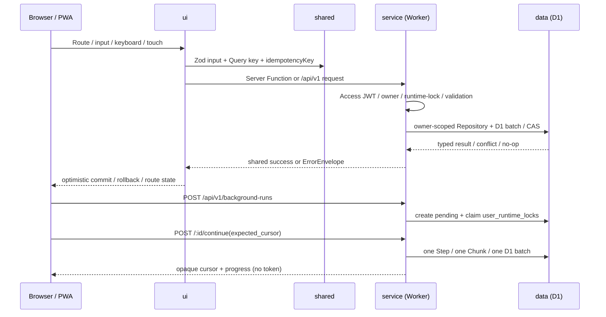

# MVP: 個人用 Linear ライクプロジェクト管理

> 要件定義書 v1.3 を、MVP を実装するための契約へ落とし込んだ設計 spec の入口。
> 本 spec はMVP実装の契約として確定済み。Q-1〜Q-8は推奨案を採用し、実装後のPreview / 実D1検証だけを残課題とする。

## 概要

個人開発者本人だけが利用する、Cloudflare Workers 上の Issue / Cycle / Project 管理アプリを実装する。Issue を中心に、Cycle の計画・繰越、Project の進捗、Saved View、検索、モバイル / PWA 操作、本人限定アクセスを一つの Worker と D1 に収める。

MVP のバックグラウンド処理は Settings から起動する手動 HTTP Chunk Runner に限定し、Cycle 境界処理・将来 Cycle 生成・論理削除 Purge・Outbox 再送を、D1 の実行ロック、Lease、cursor、効果 dedupe で安全に継続できるようにする。

## 根拠文書

- 要件入口: [`docs/requirements/index.md`](../../requirements/index.md)
- プロダクト / スコープ: [`01-product.md`](../../requirements/01-product.md)
- 機能要件: [`02-functional.md`](../../requirements/02-functional.md)
- UI / 非機能要件: [`03-ux-and-nfr.md`](../../requirements/03-ux-and-nfr.md)
- 技術・データ・処理フロー: [`04-architecture.md`](../../requirements/04-architecture.md)
- 画面・受入・テスト・完成条件: [`05-acceptance-and-delivery.md`](../../requirements/05-acceptance-and-delivery.md)
- 全体アーキテクチャ: [`docs/architecture.md`](../../architecture.md)

## 対象範囲

- 対象レイヤー:
  - [data.md](./data.md): D1 / Drizzle のスキーマ、制約、Repository、所有者境界、Migration 方針
  - [shared.md](./shared.md): Zod 入出力、公開型、エラー Envelope、列挙値、共通シリアライズ
  - [service.md](./service.md): 認証・認可、Server Functions、Background Run API、ドメイン処理、監査 / Outbox
  - [ui.md](./ui.md): 画面 Route、TanStack Query、楽観的更新、PWA、レスポンシブ / アクセシビリティ
- 対象ドメイン: `auth`, `preferences`, `workflow`, `issues`, `cycles`, `projects`, `views`, `search`, `notifications`, `audit`, `background`
- 対象環境: Cloudflare Access + TanStack Start / React + Cloudflare Workers + D1。主キーは UUID v7 または同等の時系列ソート可能 ID、日時は UTC Unix milliseconds とする。
- 対象外（やらないこと）:
  - Initiative、Timeline、Triage、テンプレート、添付ファイル、Webhook、公開 API、GitHub / Slack 連携、CSV Import / Export、高度な分析、AI 機能
  - R2、Durable Objects / WebSocket、サーバー自動 Scheduler、外部メッセージ基盤、常駐 Consumer
  - オフライン編集、完全なリアルタイム更新、ネイティブモバイルアプリ
  - Cloudflare Access の認証画面自体の実装。Access の設定はアプリ外で行う。

## ユニット計画

| # | ユニット | 含む AC | 依存 | 状態 |
|---|---|---|---|---|
| 1 | Foundation / 本人境界 / 共通契約 / 実行ロック | AC-5, AC-6, AC-9〜AC-12 | — | 未着手 |
| 2 | Issue core / 検索 / 楽観的更新 | AC-1, AC-3, AC-4, AC-7, AC-8 | Unit 1 | 未着手 |
| 3 | Cycle / 手動繰越 / 分析 | AC-2, AC-9〜AC-13 | Unit 1, 2 | 未着手 |
| 4 | Project / View / Bulk 操作 | AC-3, AC-4, AC-10 | Unit 1, 2 | 未着手 |
| 5 | Mobile / PWA / Inbox / Settings | AC-3〜AC-5, AC-9〜AC-11 | Unit 1〜4 | 未着手 |
| 6 | Release hardening / Backup / Restore 手順 | AC-1〜AC-13 | Unit 1〜5 | 未着手 |

## 受け入れ基準（AC）

> 本 spec では要件定義書の受入シナリオ 13 件を、レイヤー別 spec から参照しやすい `AC-1`〜`AC-13` に正規化する。以下が AC の正本であり、各レイヤーの「担保 AC」はこの文言をそのまま引用する。

- [ ] **AC-1**: 本人が Issues で `C` → タイトル → Enter を行うと、Preview 環境で Enter 確定から Server 採番済み Issue が一覧へ描画されるまでの p95 が 1 秒以内であり、`TASK-123` 形式の Issue 番号が採番され、専用 URL で同じ Issue 詳細を開ける。
- [ ] **AC-2**: 期限を過ぎた Active Cycle を並行して終了しても、Unstarted と Started だけが次 Cycle へ移り、Backlog / Completed / Canceled は元 Cycle に残り、元 Cycle は Completed、次 Cycle は既存行を再利用して 1 件だけ存在し、移動履歴と Outbox event は対象ごとに 1 件だけ冪等に確定する。
- [ ] **AC-3**: PC で変更した Issue の High priority がスマートフォンにも表示され、スマートフォンから Status を変更でき、タップ対象が重ならず横にはみ出さない。
- [ ] **AC-4**: Issue の Status 保存が失敗した場合、UI は変更前の Status へ戻り、エラー理由と再試行操作を表示し、他 Issue の選択と Scroll 位置を維持する。
- [ ] **AC-5**: standalone PWA で Access セッションが失効したとき、401 を Offline / Timeout / 5xx と区別し、現在 URL への Top-level Navigation で Access 再認証へ移り、再認証後に同じ Deep link へ戻り、認証応答と個人データを Service Worker に Cache しない。
- [ ] **AC-6**: Access JWT で認証した本人が手動 Run を開始したとき、Run の `user_id` と本人の所有者が一致する場合だけその `user_id` のデータを Chunk 処理し、未認証・対応する users 行なし・Run の `user_id` 不一致では業務データを更新せず失敗を記録する。
- [ ] **AC-7**: 同じ Issue version を読んだ 2 つの Mutation を並行実行したとき、条件付き UPDATE に成功した 1 件だけが保存され、もう 1 件は 409 Conflict になり、Activity・Outbox event・Mutation receipt は勝者の 1 件だけ作成される。
- [ ] **AC-8**: 成功済み Issue Mutation を同じ `idempotencyKey` と同じ Request で再送すると初回と同じ Response を返し、Issue version・Activity・Outbox event・Mutation receipt は増えず、同じ Key で異なる Request を送ると 409 `IDEMPOTENCY_KEY_REUSED` になり業務データを更新しない。
- [ ] **AC-9**: Settings から Maintenance Run を起動すると 202 と `run_id` が返り、固定 schema 以外は 400、固定 3 Step は `cycle_transition` → `purge` → `outbox_retry` の順で処理され、異なる Key の同時起動は 1 件だけが受理されて他は 423、同じ Key・同じ Request の同時再送・応答紛失後の再送は同じ `run_id` に収束し、`rejected` Run は同じ Key で再起動しない。
- [ ] **AC-10**: Background Run が `running` の間、Issue・Cycle・Project・View・Settings 等の業務 Mutation は 423 `OPERATION_IN_PROGRESS` で拒否され、version・Activity・Outbox・Mutation receipt は増えず、読み取り・進捗取得・Run 継続 / 復旧・ログアウト・Access 再認証は許可され、再読み込み後も Overlay と別端末の同一 Run 状態が復元される。
- [ ] **AC-11**: Background Run の Heartbeat が途切れて Lease が期限切れになると Run は `paused` になり Lock が解放され、古い HTTP 処理の業務データ・進捗・Run 状態・Heartbeat・Lock 更新は拒否され、同じ Run を cursor 位置から再開でき、Lease 直前は有効・期限ちょうど以降は無効である。
- [ ] **AC-12**: `pending` または `running` の Run で Step が失敗すると Run は `failed`、失敗 Step 以降は `skipped` になり、完了済み Step と業務成果物を保持して Lock を解放し、`succeeded` / `rejected` から逆戻りせず、`failed` は同じ Run の resume で失敗箇所から再開できる。
- [ ] **AC-13**: 同じ Run・Step・cursor の HTTP Chunk が再送・同時実行されても業務効果は 1 回だけで、前 Step 未完了なら効果を発生させず、resume は同じ Run の Lease を更新し、成功済み Chunk を No-op とし、返却 cursor は同値または前進のみ、`user_id` 不一致・Run 不存在は 404、paused / failed の continue は 409 `RUN_REQUIRES_RESUME`、Lease 競合は 423 になる。

## 要件トレーサビリティ

| 領域 | 主な要件 | 主な担保 |
|---|---|---|
| 認証 / 所有者 | AUTH-01〜06 | shared / service / data / ui, AC-5〜6 |
| 設定 / Workflow | PREF-01〜03, WF-01〜03 | data / service / ui, AC-10 |
| Issue / 検索 / 操作 | ISS-01〜15, NAV-01〜05 | data / shared / service / ui, AC-1, AC-3〜4, AC-7〜8, AC-10 |
| Cycle | CYC-01〜18 | data / service / ui, AC-2, AC-9〜13 |
| Project / View | PRJ-01〜08, VIEW-01〜08 | data / shared / service / ui, AC-3〜4, AC-10 |
| Inbox / 監査 / Purge | NOTIF-01〜04, 6.9 | data / service / ui, AC-9〜10 |
| 手動 Background Run | ASYNC-01〜06 | data / shared / service / ui, AC-6, AC-9〜13 |
| UI / NFR | 7.1〜8 | shared / service / ui, AC-1, AC-3〜5, AC-10〜13 |

## アーキテクチャ / レイヤー間フロー

依存方向は `ui → shared ← service → data` とする。`ui` は D1 Binding や認証 Token に直接触れず、`service` は UI 実装へ依存しない。Background Runner も `service` 内のドメイン処理と `data` の Repository だけを利用する。

## エラー・ログ方針（横断サマリ）

| シナリオ | shared / service | data | 表示層の挙動 / ログ |
|---|---|---|---|
| Access 未認証・失効 | 401 `AUTH_REQUIRED` | DB に到達しない | 401 だけを再認証として Top-level Navigation。Token / Cookie / 個人データはログ・Cache しない。 |
| 入力不正 | 400 `VALIDATION_ERROR` + `fieldErrors` | 書き込みなし | 入力箇所へ表示し再送を促す。requestId を表示可能なエラーへ紐付ける。 |
| 所有者不一致・不存在 | 404 `RESOURCE_NOT_FOUND`（認証失敗は 401） | 業務データ変更なし | 対象の存在を推測できる詳細を返さない。Security log に user / run の内部 ID と結果だけを記録する。 |
| Issue version 競合 | 409 `ISSUE_VERSION_CONFLICT` | 条件付き UPDATE 0 件、付随効果なし | 最新値を再取得し差分を提示する。Optimistic state は確定しない。 |
| 同じ idempotencyKey の異なる Request | 409 `IDEMPOTENCY_KEY_REUSED` | 業務データ変更なし | Key の値自体は表示・ログ出力せず、再利用エラーと再試行案内を表示する。 |
| Background 実行中の業務 Mutation | 423 `OPERATION_IN_PROGRESS` | version / Activity / Outbox / receipt 増加なし | フルスクリーン Overlay を維持し、読み取り・進捗・再認証・Logout だけ許可する。 |
| paused / failed Run の continue | 409 `RUN_REQUIRES_RESUME` | 業務効果なし | 「再開」を提示し、同じ Run の resume へ誘導する。 |
| Lock 競合で `rejected` になった Run の同じ Key 再送 | 409 `BACKGROUND_RUN_REJECTED` | 新しい業務効果なし | 同じ rejected 結果を表示し、新しい idempotencyKey での再起動を案内する。 |
| Lease 競合・古い Token | 423 `OPERATION_IN_PROGRESS` または No-op | 古い処理の書き込みなし | 現在の進捗を再取得し、Token は応答へ含めない。Security log / metric で検知する。 |
| D1 / 外部依存の予期せぬ障害 | 500 `INTERNAL_ERROR` + requestId | D1 batch は rollback | 再試行可能性を表示し、本文・Cookie・Token・メールアドレスを構造化ログへ出さない。 |

## テスト戦略

> 正常系の一次担保は Repository / Service / UI の各レイヤー内結合テストとする。ロジック・変換は単体テスト、Access・PWA・実ブラウザ境界だけを少数の Playwright Smoke にする。目安カバレッジは 80%+。

| AC | 単体 | レイヤー内結合 |
|---|---|---|
| AC-1 | shared の title / Issue number / response mapper | data + service の採番・作成・専用 URL取得、ui の Composer / 描画 |
| AC-2 | Cycle 境界・繰越候補・進捗集計 | 実 D1 の CAS / batch / unique 制約、service の並行終了 |
| AC-3 | priority / responsive mapper | data の端末横断保存、ui の Mobile 操作・overflow |
| AC-4 | ErrorEnvelope と optimistic rollback reducer | service の失敗応答、ui の選択・Scroll 保持 |
| AC-5 | 401 分類・Cache 判定 | service の Access 契約、ui の standalone PWA 再認証 |
| AC-6 | owner / run context 判定 | 実 D1 の user_id 境界、service の Run 所有者検証 |
| AC-7 | version / diff / request hash | 実 D1 の同時 CAS と副作用一意性 |
| AC-8 | canonical request / receipt 判定 | 実 D1 の receipt 再送・期限境界 |
| AC-9 | run plan / cursor 状態遷移 | 実 D1 の lock CAS・同時起動・3 Step API |
| AC-10 | Mutation lock matrix mapper | 全業務 Mutation の 423 Guard と副作用 0、ui Overlay |
| AC-11 | Lease 境界・古い Token 判定 | databaseNow 注入による lock / heartbeat / pause / resume |
| AC-12 | terminal / failed-step 遷移 | batch rollback、失敗後 skipped、resume |
| AC-13 | cursor 比較・dedupe key | 同一 Chunk の同時再送・Chunk 上限・所有者境界 |

Browser E2E は AC-3（Mobile / Touch）、AC-5（Access / standalone PWA）、AC-10（Overlay の Pointer / Keyboard / Route 遮断）を中心にし、正常系 CRUD の重複実装は避ける。性能試験は 1 万 Issue Seed、検索・Filter・Cycle 集計、AC-1 の p95 1 秒を Preview 環境で計測する。

## 既存実装との関係（再利用 / 差分 / 衝突）

- `src/`、`drizzle/`、TanStack Start Route、共有契約、D1 Schema、Owner / Issue Repository基盤を初回実装した。UIは `src/components/OrbitApp.tsx` に集約し、APIは `src/server/api.ts` と `/api/v1` Server Routeから公開する。
- `docs/ai-dlc/codekb/` は実装開始時点ではREADMEのみだったため、Stage 2aで参照先の不在を確認した。今回の新しいIF / Schema / 既知の罠は次回ボルトで `codekb` に追記する。
- `docs/architecture.md` の `ui / shared / service / data` 境界と依存方向を正本として採用し、要件側の `04-architecture.md` にある具体的なデータ契約・処理フローを本 spec の詳細契約へ分解する。
- アプリ本体がないため既存実装との衝突はない。ただし最初の実装から、D1 の owner scope・共有 Zod・全 Mutation の lock / idempotency を共通境界として固定する。

## 実装に効く制約

- 全ての業務 Query / Mutation は、検証済み Access JWT から解決した唯一の `user_id` を必須条件にする。`OWNER_USER_ID` 未設定・UUID 不正・users 行なし・JWT と所有者不一致は fail closed。
- Browser へ D1 Binding、Access JWT、`lock_token`、`admission_token` を露出しない。`progress_json`、通常レスポンス、通常ログにも Token を含めない。
- HTTP の Mutation は `credentials: 'same-origin'` と `X-Requested-With: XMLHttpRequest` を使い、全 Mutation に `idempotencyKey`、Issue 更新に `version` を要求する。
- D1 の条件付き UPDATE / INSERT と Unique 制約を最終判定に使う。事前 SELECT だけで認可・Lock・競合を判定しない。
- Cycle 終了、繰越、Outbox、Purge、Background Run の一つの Chunk は D1 `batch()` 単位とし、失敗時は業務効果を rollback する。
- Service Worker は version 付き公開静的 Asset のみ Cache し、SSR HTML、Server Function / API、401 / Redirect / Login、個人データは Cache しない。
- MVP では自動 Scheduler、Queue、常駐 Worker、Realtime を追加しない。Settings の手動 Run とブラウザの継続呼び出しを唯一の Background 起動経路にする。
- UI は PC / Tablet / Mobile の同じ機能契約を保ち、Pointer と Keyboard の代替操作を必ず用意する。`prefers-reduced-motion` と WCAG 2.2 AA を守る。
- 通常 API の p95 は 500ms 以下、検索 API の p95 は 800ms 以下を目標とし、検索入力の Debounce は 300ms とする。操作直後 100ms 以内の視覚 Feedback、List 初回 LCP p75 2.5 秒以下、INP p75 200ms 以下を検証する。

## 判断根拠 / 未決事項

### 採用したアプローチ

- **D1 + Drizzle を主データストアにする**: 一人用 MVP では Migration、Backup、Import / Export、Worker Binding を活用でき、Durable Objects を主 DB にするより運用と構築の複雑さを抑えられる。強い整合性が必要な箇所は D1 の条件付き更新・Unique 制約・`batch()` で担保する。
- **画面内処理は Server Functions、Background Run は `/api/v1`**: 内部画面操作は型付きの Server Function で実装し、Chunk 継続・将来の外部境界になり得る Run だけ明示的な HTTP 契約にする。MVP で公開 API 全般を作ることはしない。
- **手動 HTTP Chunk Runner を採用する**: 自動 Scheduler・外部 Queue・常駐 Consumer を導入せず、ユーザーの Settings 操作から cursor を返す継続呼び出しで MVP の運用コストを抑える。代償としてブラウザ終了・Lease 復旧を第一級の状態遷移として扱う。
- **Runtime lock は UI ではなく D1 条件にする**: Overlay だけでは別 Tab・別端末・再送を止められないため、全業務 Mutation の書き込み条件へ `user_runtime_locks` の predicate を組み込む。ジョブ自身は同じ `run_id`・`lock_token`・有効 Lease で通過させる。
- **論理削除 + 手動 Purge を採用する**: Trash から 30 日以内に復元できる要件を満たしつつ、MVP で自動運用基盤を増やさない。Purge は依存順序と対象行単位の dedupe key を持つ Chunk とする。
- **FTS5 を第一候補、Fallback を契約に含める**: D1 内で検索を完結させ、Phase 0 の英日混在・短語・1 万 Issue の品質 / 性能基準を満たさない場合は title Prefix + `description_text` の Fallback へ切り替える。外部検索基盤は Phase 2 まで作らない。
- **TanStack Query + URL state + Local UI state を分担する**: Server state を Query、共有可能な Filter を URL、開閉など一時状態を React / localStorage に分け、MVP で Redux 等の包括 Store を増やさない。
- **ローカル開発はMemory Store、本番接続はD1境界を分離する**: 開発サーバーで即時に主要Journeyを検証できるよう `OrbitStore` を使い、D1の正規化Schema / Migration / Repository境界を `src/db/` に隔離した。Previewの実D1接続と負荷検証をT7として残す。

### 未決事項

以下は実装時に採用した判断と、Preview / 実D1へ持ち越す検証項目である。

- Previewでの実D1接続、Migration適用、D1 batch / CAS / Leaseの同時実行検証
- Cloudflare Access実環境でのJWT JWKS取得、Access Policy、401→Deep link復帰のSmoke
- 1万Issueを用いた検索 / List / Cycle集計の性能計測（AC-1、NAV-01）
- DnDの実機Touchセンサー。MVPはKeyboard / Menuによる順序操作を優先し、DnDは追加候補とした。

Q-1〜Q-8 は推奨案を採用し、今回の自律実行指示によりGate 2を事後確認へ委任した。質問の揮発記録はコミット前に除去した。

## リンク

- レイヤー詳細: [data.md](./data.md) / [shared.md](./shared.md) / [service.md](./service.md) / [ui.md](./ui.md)
- 検証マトリクス: [verification.md](./verification.md)
